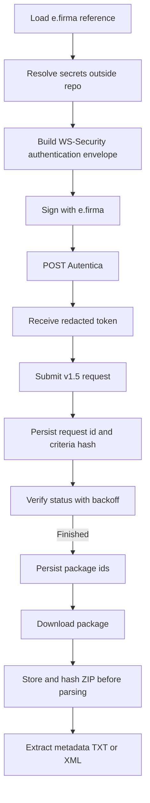

# SAT download public API research and contract

This document turns the SAT SOAP investigation into an import-first API boundary for
`cfdi_vault`. The library should help Python projects interact with SAT Descarga
Masiva without copying this whole repository, while the reference system remains the
example of how to schedule, persist, inspect, and reconcile a personal CFDI vault.

## Decision

The SAT integration must be a library boundary first and a system workflow second.
The reusable package exposes typed models, ports, result objects, parsers, fake/offline
adapters, and eventually a narrow SAT facade. The CLI, Docker runtime, PostgreSQL
schema, queue workers, live smoke commands, and manual gates belong to the reference
system unless they are explicitly promoted through the release contract.

## Verified source snapshot

Checked on 2026-07-08 from this repository using SAT-published service pages and
runtime `?singleWsdl` reads. Raw WSDL/SOAP bodies are intentionally not committed.

| Source level | Evidence | What it supports | Caution |
|---|---|---|---|
| `V1_5_CONTRACT` | Repository policy: [SAT Download Source Policy](../sat-download/source-policy.md) | Current target contract is SAT Descarga Masiva CFDI y CFDI de Retenciones v1.5. | This pass did not find a SAT-hosted v1.5 PDF, so do not invent PDF-backed claims. |
| `RUNTIME_WSDL` | SAT service pages for [authentication](https://cfdidescargamasivasolicitud.clouda.sat.gob.mx/Autenticacion/Autenticacion.svc), [request](https://cfdidescargamasivasolicitud.clouda.sat.gob.mx/SolicitaDescargaService.svc), and [verification](https://cfdidescargamasivasolicitud.clouda.sat.gob.mx/VerificaSolicitudDescargaService.svc) | Confirms WCF/SOAP client generation and `?singleWsdl` availability for those CFDI services. | Runtime availability can change; verify before endpoint or operation changes. |
| `RUNTIME_WSDL` | `?singleWsdl` parse on 2026-07-08 | Confirms `Autentica`, `SolicitaDescargaEmitidos`, `SolicitaDescargaRecibidos`, `SolicitaDescargaFolio`, and `VerificaSolicitudDescarga` operations and SOAPActions for CFDI and retenciones. It also confirms `Descargar` for retenciones download. | CFDI download `?singleWsdl` returned HTTP 400 during this pass, so do not claim CFDI runtime-WSDL confirmation for download until reconfirmed. |
| `V1_5_CONTRACT` / SAT-published URL list | SAT PDF: [URL's productivas del servicio de consulta y recuperación de comprobantes](https://wwwmat.sat.gob.mx/cs/Satellite?blobcol=urldata&blobkey=id&blobtable=MungoBlobs&blobwhere=1461174995058&ssbinary=true) | Lists productive CFDI and retenciones endpoints. | Use as endpoint evidence, not as a complete implementation guide. |
| `LEGACY_REFERENCE` | Older SAT PDFs for [request](https://wwwmat.sat.gob.mx/cs/Satellite?blobcol=urldata&blobkey=id&blobtable=MungoBlobs&blobwhere=1461175195160&ssbinary=true), [verification](https://www.sat.gob.mx/cs/Satellite?blobcol=urldata&blobkey=id&blobtable=MungoBlobs&blobwhere=1461175779527), and [download](https://wwwmat.sat.gob.mx/cs/Satellite?blobcol=urldata&blobkey=id&blobtable=MungoBlobs&blobwhere=1461174995026&ssbinary=true) documents | Explain the general SAT flow, e.firma prerequisite, WS-Security, and `Authorization: WRAP access_token="..."` pattern. | Legacy docs mention older operation names; they cannot override v1.5 split operations. |

## SAT SOAP shape

## Productive endpoints and operations

| Family | Service | Endpoint | Runtime operation(s) verified |
|---|---|---|---|
| CFDI | Authentication | `https://cfdidescargamasivasolicitud.clouda.sat.gob.mx/Autenticacion/Autenticacion.svc` | `Autentica` |
| CFDI | Request | `https://cfdidescargamasivasolicitud.clouda.sat.gob.mx/SolicitaDescargaService.svc` | `SolicitaDescargaEmitidos`, `SolicitaDescargaRecibidos`, `SolicitaDescargaFolio` |
| CFDI | Verification | `https://cfdidescargamasivasolicitud.clouda.sat.gob.mx/VerificaSolicitudDescargaService.svc` | `VerificaSolicitudDescarga` |
| CFDI | Download | `https://cfdidescargamasiva.clouda.sat.gob.mx/DescargaMasivaService.svc` | Official URL exists; `?singleWsdl` returned HTTP 400 in this pass. Keep as guarded until reconfirmed. |
| Retenciones | Authentication | `https://retendescargamasivasolicitud.clouda.sat.gob.mx/Autenticacion/Autenticacion.svc` | `Autentica` |
| Retenciones | Request | `https://retendescargamasivasolicitud.clouda.sat.gob.mx/SolicitaDescargaService.svc` | `SolicitaDescargaEmitidos`, `SolicitaDescargaRecibidos`, `SolicitaDescargaFolio` |
| Retenciones | Verification | `https://retendescargamasivasolicitud.clouda.sat.gob.mx/VerificaSolicitudDescargaService.svc` | `VerificaSolicitudDescarga` |
| Retenciones | Download | `https://retendescargamasiva.clouda.sat.gob.mx/DescargaMasivaService.svc` | `Descargar` |

## Authentication responsibilities

The library may define the contract for authentication, but it must not silently take
custody of credentials.

| Need | Library responsibility | Reference-system responsibility |
|---|---|---|
| e.firma certificate and key | Accept a caller-provided signer/credential provider boundary. | Store only local references and redacted audit events; never commit credential material. |
| Private-key password | Resolve through `SecretProviderPort` for immediate in-memory use. | Use an OS/local secret provider and keep plaintext out of config, logs, queues, and fixtures. |
| WS-Security and XMLDSig | Build/sign testable envelope shapes and expose typed failures. | Gate any real signing/live attempt behind manual approval and redacted evidence. |
| SAT token | Return a redacted `SatAuthResult`; prefer memory-only token handling. | Persist only state needed for audit; never log token values. |
| Authorization header | Use `Authorization: WRAP access_token="..."` after authentication. | Redact the value in command output, logs, state files, and support bundles. |

## Public API direction

Start narrow. A small, honest API beats exporting every useful module by accident.

| Surface | Candidate | Status now | Promotion requirement |
|---|---|---|---|
| Stable version | `cfdi_vault.__version__` | Exported today. | Keep stable. |
| Domain models | `cfdi_vault.domain.DownloadQuery`, `DateTimePeriod`, `RequestType`, `DownloadDirection`, `SatRequestState` | Good candidates. | API docs, import smoke, validation tests, semver promise. |
| Ports | `cfdi_vault.ports.SatAuthenticatorPort`, `SatRequestPort`, `SatVerificationPort`, `SatDownloadPort`, `SignerPort`, `SecretProviderPort`, `StoragePort` | Good candidates. | Prefer split ports; do not promote legacy one-method magic clients as the main contract. |
| Results/errors | `cfdi_vault.sat_contract.SatAuthResult`, `SatRequestResult`, `SatVerificationResult`, `SatDownloadResult`, `SatOutcomeAction` | Good candidates. | Add a single public error hierarchy before release. |
| Offline adapters | fake SAT, simulator, package processor, metadata/XML parsers | Good candidates. | Keep all fixtures synthetic; prove no live network. |
| Live SAT adapters | guarded live smoke/probe modules | Internal/experimental. | Needs issue, security review, source traceability, human gate, tests, and explicit opt-in. |
| CLI | `cfdi-vault` command | Reference-system interface. | Package smoke may validate it, but it is not the library API contract by itself. |

A future facade can be introduced as `cfdi_vault.sat_download` only after the names,
errors, side effects, and live/offline behavior are locked. Until then, consumers should
not import probe/live modules directly.

## Storage boundary

The library should not own the final durable storage decision. It should expose data and
ports that make correct storage possible.

| Data | Correct handling |
|---|---|
| e.firma files and password | Outside repository and outside package-managed storage; references only. |
| SAT token | Memory-only by default; redacted if surfaced in diagnostics. |
| Request criteria | Store normalized criteria hash and minimal request metadata. |
| `IdSolicitud` / `IdPaquete` | Persist in application storage, but redact in logs and support output. |
| ZIP package bytes | Store/hash before extraction; reject unsafe ZIP paths. |
| Metadata TXT/XML | Parse only after evidence preservation; fixtures must remain synthetic. |
| Queues/cache | Carry identifiers and progress, not raw XML, ZIPs, tokens, or credentials. |

The reference system can implement this with PostgreSQL, file/object storage,
RabbitMQ, Redis, and AppData profile references. Another application should be able to
implement the same ports differently without copying the CLI/runtime.

## Security gates

- No real SAT access without explicit human approval.
- No real CFDI XML, SAT metadata, ZIP packages, RFCs, certificates, keys, passwords,
  private keys, tokens, or local operator paths in the repository.
- No raw SOAP or raw SAT response bodies in committed docs, tests, logs, or evidence.
- All public errors must be typed, redacted, and actionable.
- Network/live behavior must be opt-in; fake/offline behavior remains the default.

## Release gaps before PyPI/API claims

- Create a narrow `cfdi_vault.sat_download` facade or explicitly document supported
  direct imports.
- Add public error classes for SAT auth/request/verify/download failures.
- Add clean-wheel import smoke tests for every supported public name.
- Add docstrings and API docs for every promoted class, function, method, and error.
- Keep live SAT code internal until source traceability, credential custody, and human
  gates are accepted.
- Add a separate consumer example outside the reference-system CLI path.

## Related docs

- [Repository public API plan](../release/public-api.md)
- [Library scope](../release/library-scope.md)
- [Reference system scope](../foundation/reference-system-scope.md)
- [Library quality contract](../release/library-quality-contract.md)
- [SAT service flow](../sat-download/service-flow.md)
- [SAT authentication and security](../sat-download/auth-security.md)
- [SAT source policy](../sat-download/source-policy.md)
