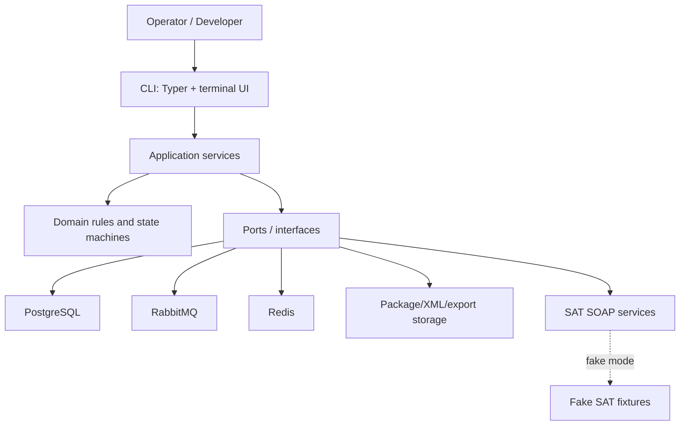
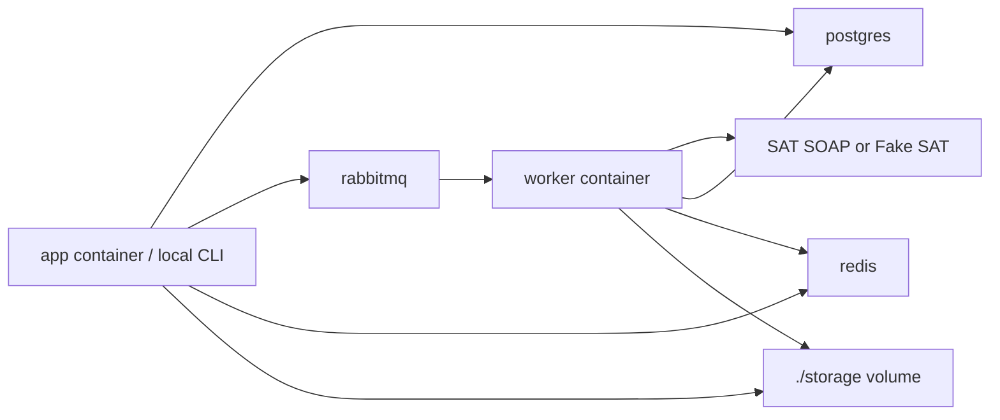
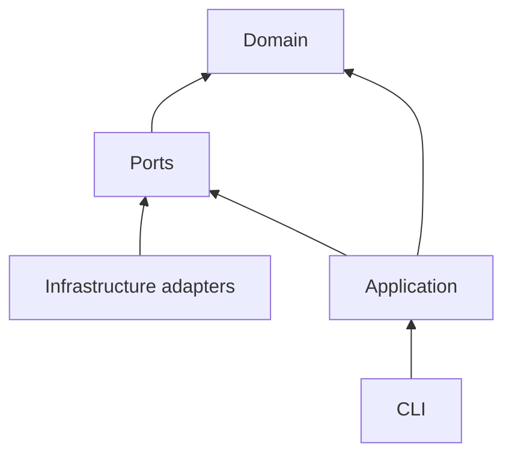

# Architecture blueprint

The system uses Clean Architecture: domain rules do not know about RabbitMQ, Redis, PostgreSQL, Typer, or SAT SOAP. Infrastructure adapters satisfy ports.

## System context

## Container view

## Code boundaries

| Layer | Owns | Must not own |
|---|---|---|
| `domain` | Value objects, request criteria, states, hashes, invariants. | SQLAlchemy, RabbitMQ, Redis, Typer, network calls. |
| `application` | Use cases: sync, verify, download, parse, reconcile, search, print/export. | Credential storage details or concrete broker clients. |
| `ports` | Interfaces for SAT, signer, queue, cache, storage, repository, search, printer. | Business decisions. |
| `infrastructure` | PostgreSQL, RabbitMQ, Redis, SOAP, filesystem, Docker. | Domain rules. |
| `cli` | User commands, progress, formatting, exit codes. | SAT protocol logic or persistence rules. |

## Dependency rule

Outer layers depend inward. Inner layers never import outer adapters.

## Architectural decisions already accepted

| Topic | Decision |
|---|---|
| Queue | RabbitMQ for durable jobs and workers. |
| Cache | Redis for progress, locks, rate limits, token cache, and worker heartbeats. |
| Database | PostgreSQL as source of truth. |
| Flexible CFDI data | PostgreSQL JSONB-compatible payloads, not MongoDB. |
| Search | PostgreSQL full-text/trigram first; OpenSearch later only if volume requires it. |
| Local/dev | Docker Compose. |
| Live SAT | Explicit opt-in only. |
