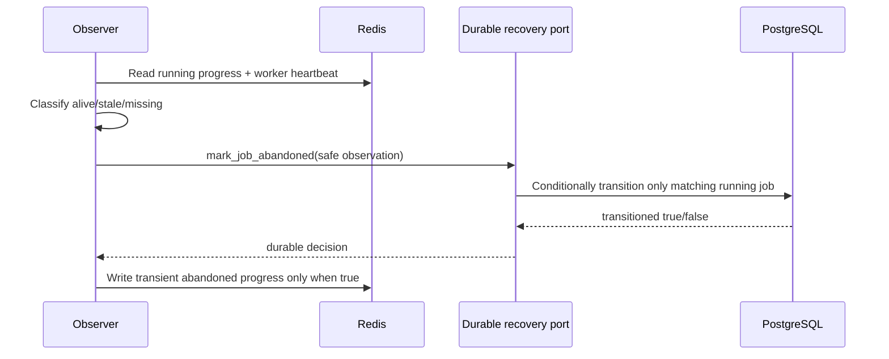

# Cache coordination contract

Status: CACHE-002 foundation contract.

## Ownership

Redis owns short-lived coordination observations only. PostgreSQL remains the
durable source of truth for jobs, queue audit, requests, evidence, and recovery
state. Deleting every Redis key may remove progress visibility and leases, but
must not delete or silently rewrite durable recovery state.

The cache contract carries opaque references. It never carries RFCs, CFDI UUIDs,
request criteria, XML, ZIP, SOAP, credentials, tokens, secrets, exception text,
or local paths.

## Key contract

| Concern | Key | Value |
|---|---|---|
| Job progress | `progress:<tenant_ref>:<job_ref>` | Exact `ProgressObservation` JSON. |
| Criteria lease | `lock:criteria:<tenant_ref>:<criteria_ref>` | Opaque owner token, never returned by the adapter. |
| Worker heartbeat | `heartbeat:<worker_ref>` | Exact `WorkerHeartbeat` JSON. |

Every reference uses a restricted opaque identifier alphabet. Path traversal,
whitespace, assignment-like text, and arbitrary payload keys are rejected.

## Progress observation

Progress contains exactly:

- `job_id` and `tenant_id`, which reference durable state;
- `worker_ref`, an opaque worker identifier;
- `status`, one of `pending`, `running`, `retry_scheduled`, `succeeded`,
  `failed`, `manual_review`, or transient `abandoned`;
- `percent`, a real number from 0 through 100 (booleans are rejected);
- timezone-aware `updated_at`.

Unknown and missing fields are rejected. Counts, package identifiers, raw
diagnostics, business payloads, and errors do not belong in progress.

Default application observations use a one-hour TTL while pending/running and
a one-day TTL after success. Expiry means "no transient observation"; callers
must consult PostgreSQL rather than infer job failure.

## Owner lease semantics

An acquire requires a 1-128 character opaque owner token using only letters,
digits, dot, underscore, and hyphen, plus a positive integer TTL:

1. `acquire_lock` succeeds only when the key has no unexpired owner.
2. `renew_lock` extends the TTL only when the stored token matches.
3. `release_lock` deletes the key only when the stored token matches.
4. A wrong or expired owner cannot renew or release another owner's lease.

Redis implements acquire with `SET NX EX`. Renew and release use atomic
compare-and-act Lua scripts. The in-memory adapter applies the same semantics
with an injected clock. There is intentionally no `get_lock_owner` operation:
owner tokens are capabilities, not diagnostics.

## Heartbeat and stale workers

Workers write a heartbeat on every queue poll and renew it periodically while a
handler is active, with the renewal interval required to be shorter than its
finite TTL. A
heartbeat is `alive` before the configured stale threshold and `stale` at or
after that exact threshold. An expired/nonexistent key is `missing`, not proof
of failure by itself.

Detection uses an injected clock in tests. Production scheduling may poll at a
different cadence, but it must keep heartbeat TTL and stale threshold explicit.

## Abandoned-job recovery

The safe abandoned observation contains only job, tenant, worker references,
timestamp, and `worker_heartbeat_stale` or `worker_heartbeat_missing`. The
durable adapter independently verifies tenant and current `running` state. It
transitions the job to `retry_scheduled` and writes a payload-free audit event.
Repeated, cross-tenant, terminal, or already-transitioned observations return
false without changing PostgreSQL.

Redis unavailability, stale data, or deletion therefore cannot authorize a
durable transition on its own.

## Failure and future API boundaries

- Cache TTL validation fails before adapter I/O.
- Malformed generic Redis JSON is treated as missing. Typed progress/heartbeat
  payloads that parse as JSON but violate their exact contract are rejected
  rather than coerced.
- Redis connection failures remain operational failures; they are not converted
  into durable job success/failure.
- CACHE-002 provides coordination primitives and observations only.
- CACHE-003 may build a durable status/read model by joining these observations
  with PostgreSQL, but it must not make Redis the recovery truth.
- API/E2E, MinIO, SAT behavior, database migrations, and queue topology are out
  of scope.

## Verification

- Contract tests cover exact values, validation, key safety, and stale boundary.
- In-memory tests cover TTL expiry, contention, owner-only renew/release,
  progress, and heartbeat.
- Redis unit tests cover command/script shape and typed round trips.
- A real Redis integration test is opt-in through
  `CFDI_VAULT_TEST_REDIS_URL`; CI evidence is required before merging the Redis
  adapter slice.
- Recovery tests prove Redis observations delegate to conditional PostgreSQL
  state rather than mutating durable truth directly.
