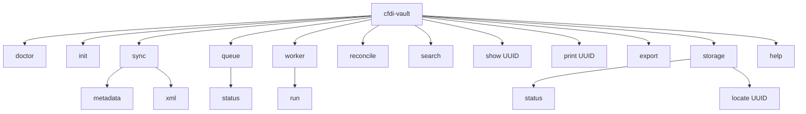

# CLI and terminal UX design

The CLI is the first user interface. It must be predictable, scriptable, and helpful under failure. Rich terminal output can improve readability, but the command contract comes first.

See [CLI help design](cli-help-design.md) for the `cfdi-vault help` command catalog and per-command explanations.

## Design principles

| Principle | Rule |
|---|---|
| Boring commands | Use explicit verbs: `doctor`, `sync`, `queue`, `search`, `show`, `print`, `export`. |
| Scriptable output | Default output should be readable; machine formats can be added with `--json` later. |
| Actionable errors | Every failure says what happened and what to do next. |
| No silent live SAT | Live SAT requires explicit `--live`. |
| No lost jobs | `--enqueue` requires RabbitMQ, not an in-memory queue. |
| Evidence first | XML/package bytes are stored and hashed before parsing. |
| Help is product UX | `cfdi-vault help` explains the flow; `--help` explains flags. |

## Command map



## Happy path

```bash
cfdi-vault doctor
cfdi-vault init --tenant-id acme --rfc AAA010101AAA
cfdi-vault sync metadata --tenant-id acme --rfc AAA010101AAA --start 2024-01-01 --end 2024-01-31
cfdi-vault sync xml --tenant-id acme --rfc AAA010101AAA --start 2024-01-01 --end 2024-01-31
cfdi-vault search AAA010101AAA
cfdi-vault show <UUID>
cfdi-vault print <UUID> --format pdf --output storage/exports/<UUID>.pdf
cfdi-vault export --format csv --output storage/exports/cfdi.csv
cfdi-vault storage locate <UUID>
```

## Progress view target

The future Rich UI should show a compact dashboard:

```text
CFDI Vault MX — Job 7f4...

SAT request       FINISHED     id_solicitud=...
Packages          2/2          downloaded, hashed
Metadata rows     1,250        upserted
XML evidence      1,184        stored
Pending XML       66           retryable
Errors            3            run: cfdi-vault queue errors --job 7f4...
```

## CLI error shape

```text
ERROR CFDI-QUEUE-001: RabbitMQ URL is required for --enqueue.
What happened: This command would enqueue a job, but no durable queue is configured.
Next action: Set RABBITMQ_URL or run without --enqueue for synchronous fake mode.
Retryable: yes
Correlation: <id>
```

## UX acceptance checklist

- [ ] Command name describes user intent.
- [ ] Required flags are minimal and obvious.
- [ ] Output includes identifiers needed for support.
- [ ] Failure output includes next action.
- [ ] Long-running work has progress or status command.
- [ ] Evidence-producing commands make storage location discoverable.
- [ ] Dangerous/live actions require explicit opt-in.
