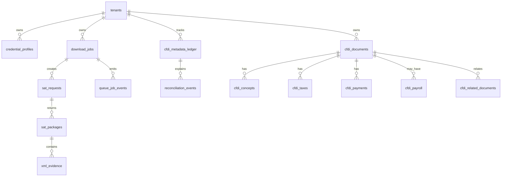
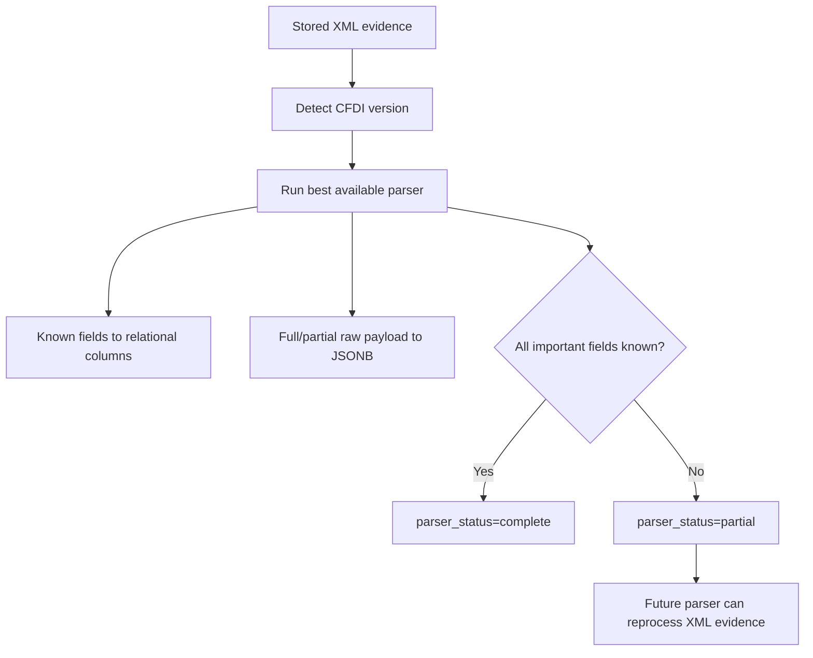

# Data and accounting model

The database must preserve accounting-friendly columns and raw evidence. PostgreSQL is the single runtime and test database target.

## Storage strategy

| Data | Storage | Reason |
|---|---|---|
| Operational jobs | PostgreSQL relational tables | Durable audit and retry control. |
| SAT raw packages | Filesystem/object storage + PostgreSQL reference | Preserve evidence before parsing. |
| XML evidence | Filesystem/object storage + SHA-256 | Auditable source of truth. |
| Common accounting fields | PostgreSQL columns | Fast search/reporting. |
| Version/complement payloads | PostgreSQL JSONB columns | Retroactive support without schema churn. |
| Queue audit | PostgreSQL append-only events | Durable retry, DLQ, and operator visibility. |
| CLI progress/locks | Redis | Fast transient state, not durable truth. |

See [XML storage and retention design](storage-and-retention.md) for the filesystem layout, growth model, manifests, and extraction UX.

See [Recovery pipeline contract](recovery-pipeline.md) for the rule that package/XML storage references must be registered before normalized CFDI rows are considered complete.

## Entity relationship overview

## Minimum accounting fields

| Field group | Columns |
|---|---|
| Identity | tenant, UUID, CFDI version, parser status. |
| Parties | issuer RFC/name, receiver RFC/name. |
| Dates | issue date, certification date, payment dates when applicable. |
| Amounts | subtotal, discount, taxes, total, currency. |
| Classification | document type, payment method/form, status, complement flags. |
| Evidence | package id, XML hash, storage key, parser version. |
| Search | normalized text, RFC/name indexes, date/total/type/status indexes. |

## Parser retroactivity rule

Parser retroactivity should run through the API/queue/worker boundary. Stored XML is read from the evidence store, work is queued with an idempotency key, and PostgreSQL receives normalized updates in short transactions.

## Index plan for PostgreSQL

| Need | Index |
|---|---|
| UUID lookup | unique `(tenant_id, uuid)` |
| RFC filters | btree issuer/receiver RFC |
| Date ranges | btree issue date |
| Amount filters | btree total |
| Status/type filters | btree status and document type |
| Concept/name search | full-text and trigram indexes |
| Complement queries | JSONB path/GiN indexes for selected complements |

## Database boundary

| Context | Database rule |
|---|---|
| Recovery runtime | PostgreSQL only. |
| Docker Compose | `DATABASE_URL` points to the `postgres` service. |
| Synthetic `import-xml` demo | Uses the same PostgreSQL `DATABASE_URL` path as the rest of the app. |
| Tests | Use a dedicated PostgreSQL test database through `CFDI_VAULT_TEST_DATABASE_URL`; pytest resets that schema from the Flyway baseline. |
| Migrations/indexes | Flyway migrations + PostgreSQL-specific JSONB/full-text/trigram indexes. |

Do not introduce another database runtime. A second persistence path creates the exact mixed architecture this foundation is trying to avoid.
