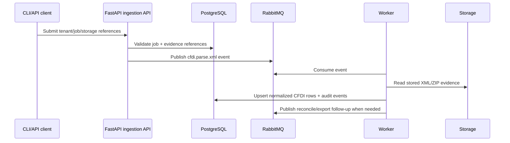

# Database, queue, and API contract

CFDI Vault MX uses PostgreSQL as the source of truth, Flyway as the schema bootstrap path, RabbitMQ as the durable work handoff, Redis for transient state, and a planned FastAPI service as the ingestion boundary.

## Quick path

1. Start PostgreSQL.
2. Run Flyway migrations from `db/migration/`.
3. Start app, worker, RabbitMQ, and Redis.

With Docker Compose:

```powershell
docker compose up -d postgres rabbitmq redis
docker compose run --rm flyway
docker compose run --rm app doctor
```

`app` and `worker` depend on the `flyway` service when they are started through Compose, so a fresh stack can create the schema before application work begins.

## Database ownership

| Area | Owner | Purpose |
|---|---|---|
| Schema versioning | Flyway | Applies ordered PostgreSQL migrations from `db/migration/`. |
| Runtime source of truth | PostgreSQL | Stores jobs, SAT request/package state, evidence references, normalized CFDI data, reconciliation state, queue audit, and synthetic import rows. |
| Application writes | Services/workers | Insert/update business state through short transactions. |
| Raw evidence | Filesystem/object storage | Stores ZIP/XML bytes; PostgreSQL stores hashes, sizes, state, and storage keys. |

The application may create tables in test/dev flows while this repository is still early-stage, but production-oriented bootstrapping must use Flyway migrations.

## Initial schema

`db/migration/V1__initial_postgresql_schema.sql` creates the baseline tables used by current code:

| Table group | Tables | Why it exists |
|---|---|---|
| Tenancy/credentials | `tenants`, `credential_profiles`, `signer_audit` | Keep logical owners, credential references, and signing audit separate from raw secrets. |
| SAT recovery jobs | `download_jobs`, `sat_requests`, `sat_packages` | Track request criteria, SAT lifecycle, packages, retries, and package evidence state. |
| Queue audit | `queue_job_events` | Persist what was enqueued/processed so RabbitMQ is not the only source of operational truth. |
| Metadata and reconciliation | `cfdi_metadata_ledger`, `reconciliation_events` | Preserve metadata-first discovery and explain UUID state transitions. |
| XML and accounting data | `xml_evidence`, `cfdi_documents`, `cfdi_parties`, `cfdi_concepts`, `cfdi_taxes`, `cfdi_payments`, `cfdi_payroll`, `cfdi_related_documents` | Store searchable accounting data while preserving XML evidence references. |
| Synthetic import path | `invoices` | Supports controlled local XML/ZIP import checks through the same PostgreSQL database boundary. |

Variable CFDI/complement payloads use PostgreSQL `JSONB` so new CFDI versions can be retained even before every field is normalized.

## Queue order and purpose

| Order | Queue | Current status | Purpose | Producer | Consumer |
|---:|---|---|---|---|---|
| 1 | `sat.request` | Implemented | Durable handoff for SAT request criteria. | CLI/API orchestration | Worker |
| 2 | `sat.verify` | Audited as event today | Track verification attempts and outcomes. | Worker | Worker/retry policy |
| 3 | `sat.download` | Audited as event today | Track package download attempts and stored ZIP references. | Worker | Worker/retry policy |
| 4 | `cfdi.parse.metadata` | Audited as event today | Parse SAT metadata and update metadata ledger/document placeholders. | Worker | Worker |
| 5 | `cfdi.parse.xml` | Planned target for post-XML ingestion | Parse stored XML evidence into normalized CFDI rows. | FastAPI ingestion API | Worker |
| 6 | `cfdi.reconcile` | Audited as event today | Reconcile metadata, XML evidence, cancellations, and final states. | Worker/API | Worker |
| 7 | `cfdi.export` | Planned | Offload large export jobs. | CLI/API | Worker |
| 8 | `dead.letter` | Planned | Hold failed jobs after retry policy is exhausted. | Worker | Operator/retry tooling |

Queue messages must carry IDs, storage keys, criteria hashes, correlation IDs, and idempotency keys. They must not carry raw XML, SAT ZIP bytes, e.firma material, private keys, passwords, or real secrets.

## API/event interaction

The planned FastAPI service should not bulk-load XML directly into PostgreSQL inside a request handler.



This keeps API requests short, makes backpressure visible, and lets workers retry safely from persisted PostgreSQL state.

## Review checklist

- [ ] New database changes are added as Flyway migrations under `db/migration/`.
- [ ] New queue names are added to `QueueName` and this contract.
- [ ] Queue payloads include idempotency/correlation data and avoid raw fiscal evidence.
- [ ] API endpoints enqueue slow work instead of doing long database loads inline.
- [ ] PostgreSQL remains the only database runtime.
