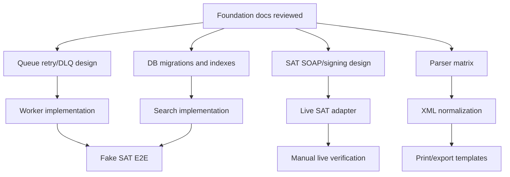

# Delegation plan

Work should be delegated by bounded responsibility, not by random file type. Each work unit must have inputs, outputs, tests, and review boundaries.

## Dependency map

## Recommended delegated work units

| Work unit | Scope | Output | Acceptance |
|---|---|---|---|
| DB/PostgreSQL | Alembic, JSONB, full-text/trigram indexes. | Migration files and repository tests. | PostgreSQL integration test passes. |
| Queue/worker | RabbitMQ exchanges, retry, DLQ, heartbeat. | Worker loop and queue policy docs. | Fake retry and DLQ tests pass. |
| Redis/cache | Progress schema, locks, rate limits. | Cache key contract and adapter tests. | Lock/rate-limit behavior tested. |
| SAT SOAP/signing | Auth, signing, request/verify/download clients. | Fake transport plus fixture parsers. | No live SAT in CI; golden tests pass. |
| Parser matrix | CFDI 3.2/3.3/4.0, payments, payroll, retenciones. | Parser registry and fixture tests. | Unknown complement marks partial. |
| CLI/UX | Rich progress, queue status, errors. | Operator-friendly commands. | CLI tests and snapshots. |
| Print/export | HTML/PDF/CSV templates. | Auditable outputs. | Partial-parse warning shown. |
| QA/security | Fixtures, redaction, no secret leaks. | Test policy and CI checks. | Real credentials/XML cannot be committed. |

## Review rule

Any work unit that changes more than one architectural layer needs:

1. updated foundation doc or ADR;
2. tests in the same work unit;
3. fresh review before merge.

## Not ready for delegation yet

| Area | Why |
|---|---|
| Live SAT production credentials | Security model and custody mode need final approval. |
| Carta Porte normalization | Scope is too large; needs its own parser research. |
| OpenSearch | No measured PostgreSQL search limit yet. |
