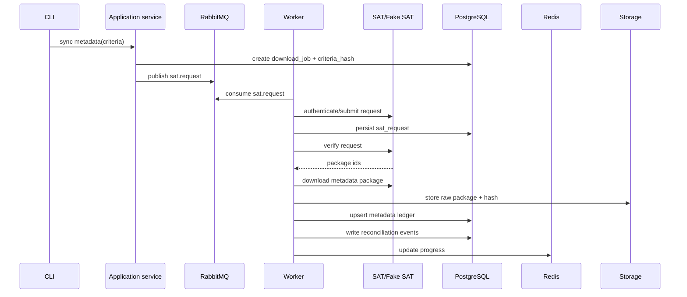
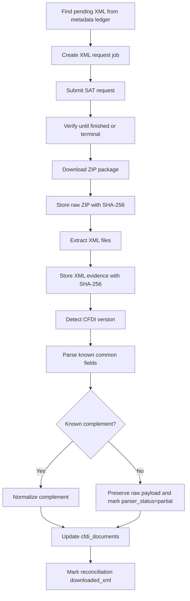
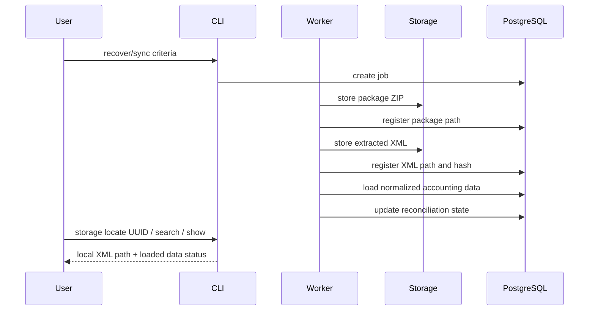
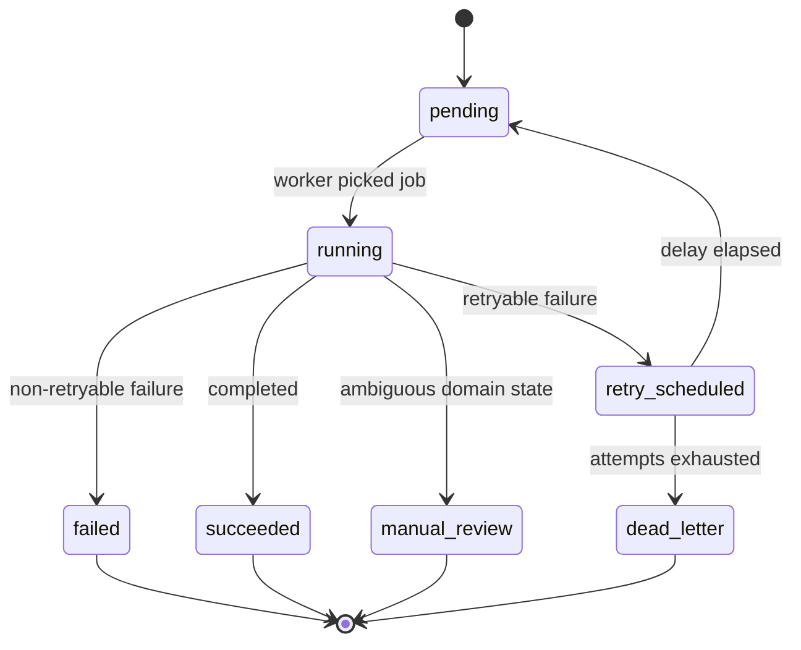

# Flows and states

This document defines the operational flows before deeper implementation.

The user-facing behavior is one recovery pipeline. See [Recovery pipeline contract](recovery-pipeline.md) for the rule that download, extraction, database loading, and local evidence registration belong to one auditable job.

## Metadata sync flow

## XML sync flow

## Unified recovery flow

## Queue state machine

## Reconciliation states

| State | Meaning | User/operator message |
|---|---|---|
| `metadata_seen` | Metadata exists but XML need is not classified. | "Metadata found; XML classification pending." |
| `pending_xml` | XML is expected and missing. | "XML is pending; a recovery job can be scheduled." |
| `downloaded_xml` | XML evidence exists with hash. | "XML evidence is stored." |
| `cancelled_no_xml_expected` | Cancelled document should not trigger blind XML retries. | "Cancelled CFDI; no automatic XML retry." |
| `expired_package_retryable` | Package expired before evidence was stored. | "Package expired; create a recovery request." |
| `quota_limited` | SAT quota/limits prevent progress. | "SAT limit reached; retry later." |
| `manual_review` | Evidence/status conflict. | "Manual review required; inspect request/package history." |

## Error contract

Every error shown to a user should include:

- internal code;
- SAT code/message when available;
- user message;
- developer detail;
- next action;
- retryability;
- correlation id;
- job/request/package identifiers when available.
