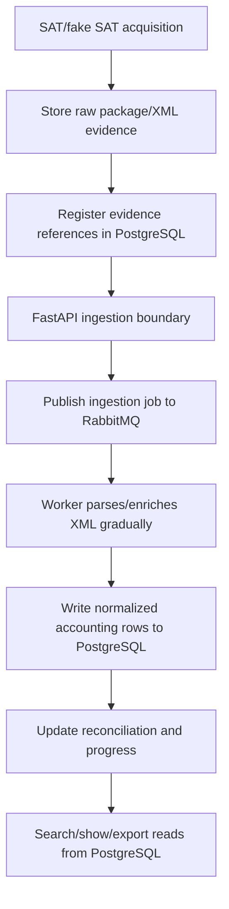

# Infrastructure boundary

CFDI Vault MX recovery work uses PostgreSQL as the durable source of truth, RabbitMQ as the work handoff boundary, Redis for transient state, and filesystem/object storage for raw evidence.

## Decision

| Concern | Decision |
|---|---|
| Durable database | PostgreSQL owns recovery jobs, SAT requests, package/XML evidence references, reconciliation events, accounting tables, and search indexes. |
| Schema bootstrap | Flyway owns ordered PostgreSQL migrations in `db/migration/`; Docker Compose exposes a `flyway` service for fresh-start schema creation. |
| Queue | RabbitMQ owns asynchronous work handoff and backpressure. Queue messages should carry IDs, storage keys, and correlation data, not raw XML or secrets. |
| API boundary | A future FastAPI service will own ingestion-facing endpoints and short transactional boundaries. It should accept stored XML/package references, validate them, and publish/coordinate ingestion jobs. |
| Worker responsibility | Workers consume queued work gradually, parse or enrich stored XML, and write normalized rows into PostgreSQL. They should not depend on one giant CLI process holding the full recovery flow. |
| Redis | Redis stores transient progress, locks, token cache, rate-limit state, and worker heartbeat. Redis is never the source of truth. |
| Storage | The filesystem/object storage layer keeps raw ZIP/XML evidence. PostgreSQL stores hashes, sizes, state, and storage references. |

## Current Docker Compose contract

`docker-compose.yml` runs the infrastructure that the recovery path is expected to use:

| Service | Purpose |
|---|---|
| `postgres` | Durable recovery/accounting database. |
| `flyway` | Applies versioned PostgreSQL migrations from `db/migration/` before app/worker startup. |
| `rabbitmq` | Durable queue broker for recovery and ingestion jobs. |
| `redis` | Transient progress, locks, token cache, rate-limit state, and worker heartbeat. |
| `app` | CLI/container entrypoint for operator commands and future API-adjacent orchestration. |
| `worker` | Queue consumer process. Current implementation is a worker shell; retry/DLQ policy is still planned. |
| `./storage:/app/storage` | Host-visible package/XML/evidence storage. |
| `./logs:/app/logs` | Host-visible runtime logs. |

FastAPI is intentionally not a Compose service yet because the API code does not exist. Add an `api` service only when the FastAPI ingestion boundary is implemented and tested.

## Target recovery flow

## Queue usage rule

Use queues where the work is slow, retryable, or fan-out:

- XML ingestion after package/XML evidence exists;
- parser/enrichment work for stored XML;
- reconciliation follow-up;
- retryable SAT verification/download steps;
- backfill batches;
- operator-visible progress events.

Do not use queues just to hide synchronous code. A queue message must have an idempotency key, retry/DLQ behavior, and enough persisted state in PostgreSQL to resume safely.

## PostgreSQL write rule

PostgreSQL writes should be small and explicit:

1. The acquisition path may write minimal job/evidence rows needed for idempotency and audit.
2. The ingestion API/worker path writes normalized accounting data after XML exists in storage.
3. Long XML parsing/backfill work must not run as one direct CLI-to-database bulk load.

## Redis usage rule

Redis may store:

- `progress:{job_id}`;
- short-lived locks for criteria/request idempotency;
- rate-limit counters;
- token/session cache when live SAT support is approved;
- worker heartbeat.

Redis must not store:

- raw XML;
- SAT ZIP payloads;
- e.firma material;
- PostgreSQL source-of-truth rows;
- queue payloads that need audit retention.

## Implementation gaps

- Expand Flyway migrations beyond the initial baseline as the model evolves.
- Add PostgreSQL full-text/trigram indexes where measured search needs justify them.
- Implement RabbitMQ exchanges, routing keys, retry, and DLQ policy.
- Add the FastAPI ingestion service and its request/response contract.
- Move heavy XML normalization behind the API/queue/worker boundary.
- Add worker heartbeat and Redis lock/rate-limit behavior.
