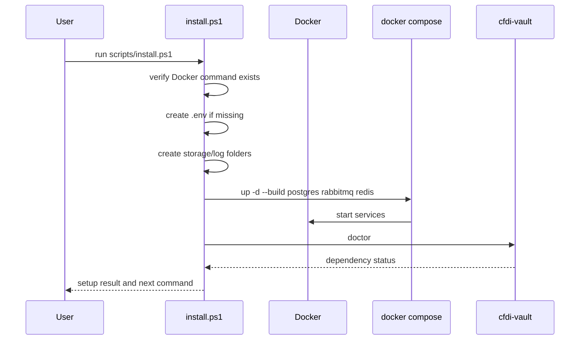

# Local installer and onboarding design

The installer should make local development usable without hiding infrastructure. It creates folders, generates environment/config scaffolding, starts Docker services when requested, runs `doctor`, and points the user to the CLI onboarding flow for profile setup.

## Installer goals

| Goal | Rule |
|---|---|
| Repeatable setup | Running the installer twice should not destroy data. |
| Transparent config | Generate `.env` from `.env.example`, do not hardcode secrets in scripts. |
| Safe credential handling | Validate e.firma file shape and collect the private-key phrase only through a hidden prompt; never write credential material to config. |
| Clear failure | If Docker is missing or a service is unhealthy, say exactly what failed. |
| Local storage | Create the selected storage root and the RFC/period layout through `cfdi-vault onboard`. |
| Visible data location | Show the resolved storage path after setup so the user knows where XML lives. |

## Windows flow



## Folder layout

```text
cfdi-vault-mx/
  .env
  docker-compose.yml
  storage/
    packages/
    xml/
    exports/
  logs/
```

See [XML storage and retention design](storage-and-retention.md) for the target production layout and growth policy.

## Installer command contract

| Command | Purpose |
|---|---|
| `.\scripts\install.ps1` | Full local setup. |
| `.\scripts\install.ps1 -SkipDockerUp` | Create config/folders only. |
| `cfdi-vault onboard` | Create or update a safe local RFC profile config without storing secrets. |
| `docker compose run --rm app doctor` | Verify services from container context. |

## Onboarding command contract

`cfdi-vault onboard` is the first implementation for desktop setup. It asks for:

- storage root;
- RFC/profile id;
- issued, received, or both download mode;
- initial date range;
- disabled, interval, or daily periodicity;
- maximum concurrency;
- local certificate and key files;
- private-key phrase through hidden input.

It stores only RFC, storage root, preferences, certificate fingerprint, and external credential references. It does not copy credential files into the repo and does not write the private-key phrase.

## What the installer/onboarding must not do yet

- Persist the private-key phrase.
- Copy `.cer` or `.key` files into the repo.
- Submit live SAT requests.
- Delete existing volumes or storage.
- Hide Docker Compose from the user.

## Acceptance checklist

- [ ] Fresh clone can run installer.
- [ ] Existing `.env` is preserved.
- [ ] Required folders are created.
- [ ] Onboarding writes a valid config with references and certificate fingerprint only.
- [ ] The final message shows where XML and packages are stored.
- [ ] Docker services become healthy.
- [ ] `doctor` runs at the end.
- [ ] Failure message points to the broken dependency.
