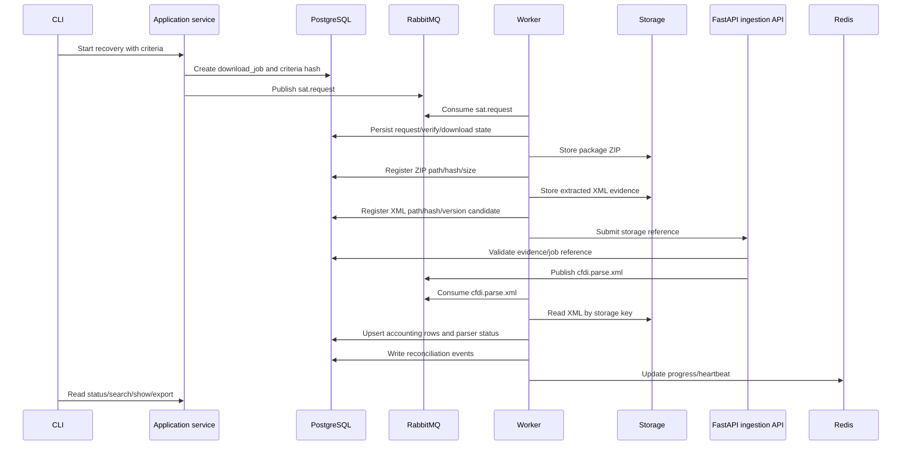

# Module responsibilities and execution boundaries

This document is the responsibility map for CFDI Vault MX. It explains what each layer,
module, runtime process, and workstream owns so future branches and agents do not turn the
CLI, API, worker, or database into a God component.

## Decision

The CLI starts and observes work. Application services coordinate use cases. Workers perform
long-running jobs. PostgreSQL stores durable state and accounting data. Storage keeps raw ZIP/XML
evidence. RabbitMQ hands off work. Redis keeps transient progress/locks. MinIO is available as an
optional Docker object-storage lab. FastAPI accepts stored references and enqueues ingestion work.
The SAT v1.5 library exposes reusable Python contracts, not the reference-system runtime.

## Quick path

1. Preserve evidence first: store ZIP/XML bytes and register hashes/paths before parsing.
2. Pass references between systems: queue/API payloads carry IDs and storage keys, not raw fiscal payloads.
3. Parse through version-aware extractors: CFDI 3.2, 3.3, 4.0, and complement-specific parsers.
4. Store accounting data in PostgreSQL while keeping XML evidence re-processable.
5. Run each implementation branch in its own git worktree when work is parallel or isolated.

## Responsibility by architecture level

| Level | Owns | Output | Must not do |
|---|---|---|---|
| Archetype | Split library vs reference system. | Clear promise for reusable package and local case-study runtime. | Claim the CLI/Docker stack is the public library API. |
| Architecture | Clean/Hexagonal boundaries. | Domain, ports, application, adapters, and runtime diagrams. | Let inner layers import Typer, SQLAlchemy sessions, RabbitMQ, Redis, or SOAP clients. |
| System | CLI, API, worker, PostgreSQL, RabbitMQ, Redis, storage, SAT. | Runtime responsibilities and handoff contracts. | Let one process own download, extraction, parsing, DB load, and UI forever. |
| Module | Python modules/classes. | Small contracts with tests and docs. | Hide side effects or reach across layers directly. |
| Execution | Branch/worktree plan. | Parallelizable feature slices with dependencies. | Start dependent work before its base branch is merged into `dev`. |

## Runtime responsibility map

| Runtime component | Responsibility | Durable output | Transient output | Forbidden payloads |
|---|---|---|---|---|
| CLI | Trigger commands, validate operator intent, show progress, format results. | May create a job through application services. | Terminal output and exit code. | Raw SOAP, raw SAT responses, secrets, raw XML/ZIP bytes. |
| Application services | Coordinate use cases, enforce domain flow, call ports. | Job/request/package/evidence/accounting state through repositories. | In-memory orchestration state. | Concrete broker/cache/storage decisions. |
| FastAPI ingestion API | Accept stored XML/package references, validate short transactions, enqueue work. | Request/job correlation and API audit state. | HTTP response with correlation id. | Raw XML, raw ZIP, e.firma material, tokens, long parser loops. |
| Worker | Consume jobs, download/extract/parse/reconcile in retryable units. | PostgreSQL updates and storage references. | Worker heartbeat/progress. | Human prompts, CLI formatting, secret logging. |
| PostgreSQL | Source of truth for jobs, request/package state, XML evidence refs, accounting data, reconciliation, queue audit. | Tables and Flyway-managed schema. | None. | Raw credential material; it should store references and redacted audit only. |
| Storage | Keep raw package ZIPs, extracted XML, exports, and evidence files. | Bytes plus path/object keys. | None. | Business state decisions. |
| MinIO | Optional S3-compatible lab for object keys and bucket behavior. | Local object-storage volume. | Console/API session state. | Required app/runtime dependency or library dependency. |
| RabbitMQ | Durable handoff for slow/retryable jobs. | Message delivery and DLQ state. | Queue depth/backpressure. | Raw XML, ZIPs, SOAP bodies, secrets, e.firma material. |
| Redis | Progress, locks, rate limits, token cache when approved, worker heartbeat. | None; it is not source of truth. | Short-lived keys. | XML/ZIP bytes, queue audit, PostgreSQL records, secrets. |
| SAT v1.5 library | Typed request/auth/verify/download contracts, ports, results, fake/offline adapters. | Reusable Python API. | Caller-managed objects/results. | Reference-system assumptions like Docker, PostgreSQL, RabbitMQ, or CLI internals. |

## Data ownership

| Data | Primary owner | Secondary owner | Notes |
|---|---|---|---|
| SAT package ZIP | Storage | PostgreSQL `sat_packages` ref/hash/size/state. | Store before extraction; never parse directly from transient response. |
| XML evidence | Storage | PostgreSQL `xml_evidence` ref/hash/version/parser status. | Re-processable source for future parsers. |
| Accounting fields | PostgreSQL | Parser/worker writes. | Searchable normalized rows plus JSONB for variable/complement payloads. |
| Metadata ledger | PostgreSQL | Worker/reconciliation. | Metadata is the control plane for XML recovery decisions. |
| Queue events | PostgreSQL + RabbitMQ | Worker. | PostgreSQL audit explains what RabbitMQ did or needs to retry. |
| Progress/locks | Redis | PostgreSQL for durable job state. | Redis can disappear without losing the recovery truth. |
| e.firma/password/token | Caller/secret provider | Redacted audit only. | Never commit or persist raw values in repo/runtime evidence. |

## End-to-end handoff

## Parser responsibility

Each CFDI version gets an explicit extractor class or adapter. Common parsing can be shared,
but version behavior must be visible.

| Parser | Input | Output | Partial behavior |
|---|---|---|---|
| Version detector | Stored XML bytes. | `3.2`, `3.3`, `4.0`, or `unknown`. | Unknown goes to partial/manual-review, not data loss. |
| CFDI 3.2 extractor | XML evidence reference. | Common accounting fields + version payload. | Missing unsupported complement fields are retained in JSONB/raw payload. |
| CFDI 3.3 extractor | XML evidence reference. | Common accounting fields + version payload. | Same partial contract. |
| CFDI 4.0 extractor | XML evidence reference. | Common accounting fields + version payload. | Same partial contract. |
| Complement registry | Complement nodes. | Payments, payroll, or registered complement payloads. | Unknown complement is preserved and marks parser status `partial`. |

## Storage and MinIO decision

Start with the filesystem storage already used by the reference system. Docker Compose now exposes
MinIO as an optional lab for object-storage behavior, but production code should use it only through
an object-storage adapter behind the storage port, not as a domain dependency.

| Option | Use | Tradeoff |
|---|---|---|
| Filesystem storage | Default local/reference-system evidence store. | Simple and already aligned with local workflows. Harder to model remote/object semantics. |
| MinIO | Optional S3-compatible development lab behind the Compose `object-storage` profile. | Good practice for buckets, object keys, and future cloud portability. Adds service/test complexity and must remain optional. |
| Cloud object storage | Future production-style adapter. | Useful later, but should wait until the storage port and MinIO adapter prove the contract. |

MinIO adapter work should be planned inside `feature/storage-object-minio-adapter` after the
storage port/object-key contract is accepted. Do not add it as a required dependency for the
library package, app, or worker before adapter tests exist.

## Module obligations

| Module/work area | Obligation | Completion signal |
|---|---|---|
| `cfdi_vault.domain` | Define criteria, states, queue names, metadata, and parser status concepts. | Domain tests cover transitions and serialization. |
| `cfdi_vault.ports` | Define storage, SAT, queue, cache, secret, signer, repository boundaries. | Consumers can implement ports without importing adapters. |
| `cfdi_vault.storage` | Build safe storage keys/paths and evidence metadata. | ZIP/XML evidence can be located by UUID/job/package. |
| `cfdi_vault.cfdi_parser` | Version-aware parser registry and extractors. | Tests prove 3.2/3.3/4.0 and unknown/partial behavior. |
| `cfdi_vault.queueing` | RabbitMQ adapter, retry routing, DLQ-compatible message behavior. | Retry/DLQ tests and queue status visibility. |
| `cfdi_vault.cache` | Redis progress/lock/heartbeat adapter. | Lock and heartbeat tests pass without making Redis durable truth. |
| `cfdi_vault.worker` | Consume jobs and execute retryable units. | Worker processes `sat.request`, `cfdi.parse.xml`, and reconciliation jobs. |
| `cfdi_vault.api` | Future FastAPI ingestion endpoints. | Endpoint accepts references, validates state, enqueues work, and rejects raw payloads. |
| SAT v1.5 modules | Auth/request/verify/download envelopes and results. | Offline/fake tests pass; live remains human-gated. |
| CLI adapters | Operator commands and progress UX. | CLI outputs actionable status without leaking sensitive values. |

## Review checklist

- [ ] The component has one owner and one reason to change.
- [ ] Inputs and outputs are typed or documented.
- [ ] Raw evidence is stored before parsing.
- [ ] Queue/API payloads carry references, not raw XML/ZIP/secret data.
- [ ] PostgreSQL owns durable state; Redis owns only transient state.
- [ ] Parser behavior records version and partial/complete status.
- [ ] The implementation branch can be reviewed without unrelated modules.
