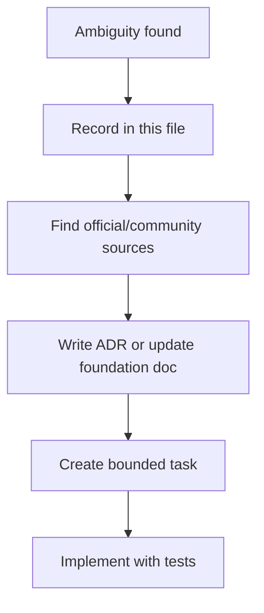

# Open questions and ambiguity register

This file records what is not safe to assume yet. Each item should be resolved before the corresponding implementation work starts.

| ID | Question | Why it matters | Current stance | Owner |
|---|---|---|---|---|
| Q1 | Which credential custody modes are allowed in v1? | Determines installer, signer, and security model. | Start with `manual-local`; do not persist passwords. | Security/signing |
| Q2 | Which SAT observed behaviors are official vs community-derived? | Avoids documenting compatibility behavior as official law/spec. | Keep source matrix and label observed behavior. | SAT research |
| Q3 | What are exact retry limits per queue? | Prevents infinite loops and SAT abuse. | Design before implementing retry/DLQ. | Queue worker |
| Q4 | Which CFDI complements are normalized in v1? | Controls schema and parser scope. | Payments and payroll first; Carta Porte later. | Parser |
| Q5 | What does "printed invoice" mean for v1? | Avoids wasting time on pixel-perfect official PDF. | Use auditable accounting view first. | CLI/UX |
| Q6 | What volume requires OpenSearch? | Prevents premature infrastructure. | Stay on PostgreSQL search until measured. | DB/search |
| Q7 | How are tenants isolated? | Critical for multi-RFC/multi-client safety. | Every durable row must include tenant scope. | Architecture |
| Q8 | How are real XMLs redacted in logs/tests? | Protects taxpayer data. | No real XML in repo or CI. | QA/security |
| Q9 | What storage partition policy is final for production? | Prevents one huge XML folder and makes backups/extraction predictable. | Target tenant/year/month partitioning; prototype still uses simpler paths. | Storage/evidence |
| Q10 | What exact FastAPI ingestion contract accepts stored XML/package references? | Prevents direct bulk DB loads from the SAT/CLI process and keeps queue backpressure explicit. | Define API payloads before moving normalized XML loading behind workers. | API / Queue / Data |

## Decision workflow

## Current debt from implementation-before-foundation

| Debt | Correction |
|---|---|
| v2 code exists before full architecture gate. | Treat current code as first prototype slice, not final architecture. |
| RabbitMQ retry/DLQ is not fully designed. | Do not expand worker until retry/DLQ doc is accepted. |
| PostgreSQL search indexes are documented but not fully migrated. | Add Flyway index migrations before production search scale-up. |
| FastAPI ingestion boundary is planned but not implemented. | Do not add an `api` Docker service or route XML loading through API docs until the contract and code exist. |
| Parser only extracts common fields. | Keep parser status explicit and preserve raw XML/JSON payloads. |
| XML storage prototype is not period-partitioned yet. | Add storage key builder, manifests, and `storage locate/status` before high-volume use. |
