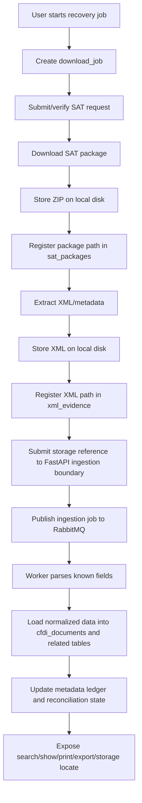
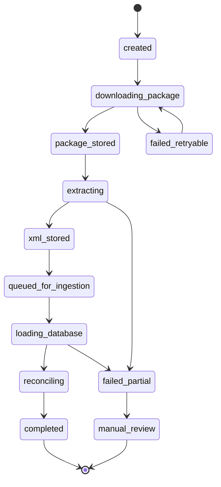

# Recovery pipeline contract

The user-facing workflow is one recovery pipeline. Internally it has stages, but users should not have to manually coordinate download, extraction, database loading, and local evidence registration.

## Decision

One recovery job owns the full chain:

1. request/download package;
2. register package location on disk;
3. extract XML/metadata;
4. register extracted XML location on disk;
5. submit stored XML/package references to the FastAPI ingestion boundary;
6. enqueue parser/ingestion work through RabbitMQ;
7. load normalized/searchable data into PostgreSQL from workers;
8. reconcile UUID state;
9. expose storage location and status to the user.

If any stage fails, the job must preserve what was already downloaded and tell the user what is missing.

## Pipeline overview

## Stage ownership

| Stage | Durable output | User-visible result |
|---|---|---|
| Download | `sat_requests`, `sat_packages`, raw ZIP file | Package id, request id, local ZIP path |
| Extraction | XML files, XML hashes, `xml_evidence` rows | UUID-to-file location |
| Ingestion handoff | RabbitMQ message with storage key, tenant, job id, and idempotency key | Work is visible and retryable instead of hidden inside one CLI process |
| Version extraction | Parser version/status metadata on `xml_evidence` and accounting payload rows | Future parsers can reprocess stored XML evidence |
| Data loading | `cfdi_documents`, parties, concepts, taxes, JSON payloads | Searchable accounting data |
| Reconciliation | metadata ledger and reconciliation events | Pending/downloaded/manual-review state |
| Access | search/show/print/export/storage commands | User can find the XML and extracted data |

## Single-job state

## Partial failure rule

| Failure point | Must preserve | Next action |
|---|---|---|
| SAT request fails before package | request/job event | Retry if SAT/transport says retryable. |
| Package downloaded but extraction fails | raw ZIP + SHA-256 + package row | Retry extraction locally, not SAT download. |
| XML extracted but parser fails | XML file + SHA-256 + evidence row | Mark parser status partial/manual-review. |
| Ingestion queue publish fails after XML storage | XML file + evidence row | Retry publish from PostgreSQL state; do not redownload from SAT. |
| DB load fails after XML storage | XML file + evidence row + queue event | Retry the ingestion job through RabbitMQ/DLQ policy. |
| Reconciliation conflict | all previous evidence | Manual review with request/package/XML paths. |

## User promise

After a recovery job, the user should be able to answer:

- Was the SAT package downloaded?
- Where is the package on my machine?
- Which XML files were extracted?
- Where is each XML on my machine?
- Which records were loaded into PostgreSQL?
- Which UUIDs are still pending or need review?

No implementation slice is complete if it cannot answer those questions.
