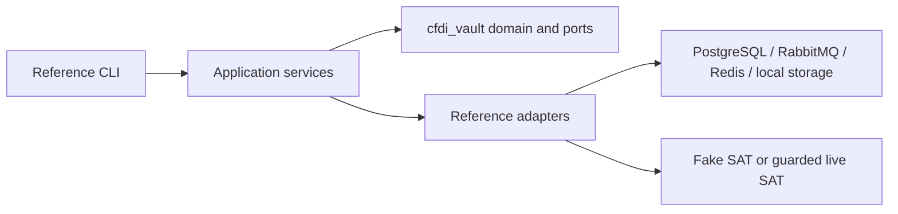

# Reference system scope

The reference system is the repository-level example that shows how the reusable
library pieces can power a personal/local CFDI vault.

## Decision

The reference system explains the architecture end to end: CLI, local profile setup,
Docker runtime, PostgreSQL evidence/state, queues, cache, workers, operator runbooks,
and safety gates. It is a case study and implementation guide, not the whole library
contract.

## Reference system owns

| Area | Responsibility |
|---|---|
| CLI | Operator commands for setup, doctor, fake sync, queue status, search, print, export, and guarded live smoke. |
| Runtime | Docker/local composition of PostgreSQL, RabbitMQ, Redis, workers, and adapters. |
| Persistence | Application tables, queue audit, package/XML references, hashes, attempts, and reconciliation state. |
| Local profile | AppData/local configuration with credential references and redacted status. |
| Runbooks | Human-gated live SAT procedures, evidence capture, and rollback/cleanup steps. |
| Case study docs | Architecture decisions, planning, sprint work, and learning material. |

## Reference system does not promise

| Non-promise | Reason |
|---|---|
| Production tax/accounting certification | This repo is a development-stage case study. |
| Silent live SAT automation | Real SAT/e.firma access needs explicit approval and secure handling. |
| Stable Python imports | Only the library public API docs define stable imports. |
| Multi-tenant SaaS custody | Credential custody and legal delegation are out of scope unless separately designed. |

## How it uses the library

The system should consume library contracts through adapters. If a feature cannot be
used without importing CLI internals or copying runtime assumptions, it is not a clean
library feature yet.

## Related docs

- [Product split](../product-archetype.md)
- [Library scope](../release/library-scope.md)
- [Repository public API plan](../release/public-api.md)
- [SAT download public API research and contract](../api/sat-download-public-api.md)
