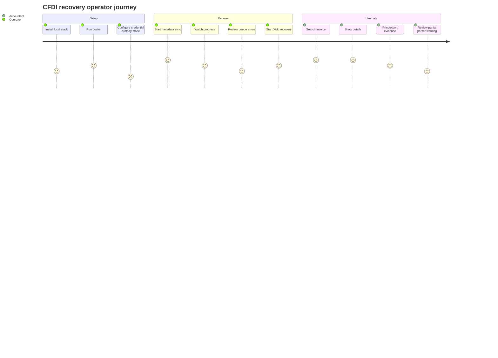

# User stories and acceptance criteria

This document defines what the product must do from the user's perspective before more implementation is delegated.

## Personas

| Persona | Goal | Risk if ignored |
|---|---|---|
| Operator | Recover CFDI metadata/XML and understand progress/errors. | The CLI becomes powerful but unusable. |
| Accountant | Search, inspect, print, and export auditable invoice data. | Data exists but cannot support accounting work. |
| Developer | Integrate the library safely with clear ports and fake SAT. | Contributions create tight coupling and fragile tests. |
| Maintainer | Review small work units with documented scope. | Parallel work creates merge conflicts and technical debt. |

## Core journey

## Epics

| Epic | Outcome |
|---|---|
| E1 Local installation | User can install and verify the stack without reading source code. |
| E2 Metadata recovery | User can recover a metadata ledger for a period/RFC. |
| E3 XML evidence recovery | User can store raw ZIP/XML evidence and know what is missing. |
| E4 Reconciliation | User can see why a UUID is pending, complete, cancelled, expired, or manual-review. |
| E5 Search and output | User can search, show, print, and export accounting-friendly data. |
| E6 Developer integration | Developer can run fake SAT and write adapters without live credentials. |

## User stories

| ID | Story | Acceptance criteria |
|---|---|---|
| US-001 | As an operator, I want to run `cfdi-vault doctor` so I know whether PostgreSQL, RabbitMQ, Redis, and storage are reachable. | Shows one row per dependency; exits non-zero when any dependency fails; gives next action. |
| US-002 | As an operator, I want to initialize a tenant/RFC so downloads are scoped correctly. | Requires tenant id and RFC; does not ask for e.firma password by default; writes tenant row. |
| US-003 | As an operator, I want to start metadata sync for a date range. | Validates range; creates criteria hash; prevents accidental duplicate requests. |
| US-004 | As an operator, I want to enqueue work and let workers process it. | `--enqueue` requires RabbitMQ; worker shows processed count and job status. |
| US-005 | As an operator, I want to see job progress. | Shows job id, request id, package count, metadata count, and error state. |
| US-006 | As an accountant, I want to search invoices by UUID/RFC/name/date/total/text. | Returns matching rows; supports no-result message; limits output safely. |
| US-007 | As an accountant, I want to show a CFDI detail view. | Displays issuer, receiver, date, type, status, totals, parser status, and evidence warning. |
| US-008 | As an accountant, I want to print/export invoice data. | Supports CSV and basic printable output; warns when parser status is partial. |
| US-009 | As a maintainer, I want unknown complements preserved. | Parser does not fail whole import; raw payload/evidence stays available; status becomes partial. |
| US-010 | As a developer, I want fake SAT fixtures. | CI can test request/verify/download without credentials or live SAT calls. |
| US-011 | As a new user, I want `cfdi-vault help` to explain the command flow so I know what to run next. | Shows recommended recovery flow, command catalog, per-command examples, and non-zero exit for unknown topics. |

## Story readiness checklist

- [ ] The story has a user and outcome.
- [ ] The input and output are clear.
- [ ] The success path has a CLI example.
- [ ] Error cases include user-facing messages.
- [ ] Data persistence and evidence rules are documented.
- [ ] Acceptance criteria can be tested without live SAT.
