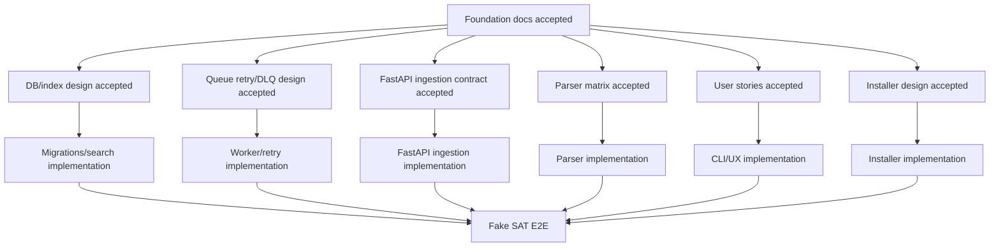

# Workstream ownership and parallel development

Parallel work is allowed only when each stream has a clear owner, write scope, dependencies, and acceptance criteria. The goal is speed with discipline, not random concurrency.

## Ownership model

| Workstream | Owner role | Primary docs | Write scope | Depends on |
|---|---|---|---|---|
| Product/UX | Product architect | `user-stories.md`, `cli-ux-design.md` | Docs, CLI copy specs | Foundation review |
| Installer/dev environment | Infra owner | `installer-design.md` | Docker, scripts, env docs | Product setup stories |
| Storage/evidence | Storage owner | `storage-and-retention.md` | storage key builder, manifests, locate/export commands | data model |
| Recovery pipeline | Application owner | `recovery-pipeline.md`, `flows-and-states.md` | orchestration, stage transitions, partial failure behavior | storage and data model |
| DB/search | Data owner | `data-and-accounting-model.md` | migrations, repositories, indexes | DB ADR |
| Queue/worker | Queue owner | `flows-and-states.md` | queue adapters, worker, retry policy | retry/DLQ design |
| API/ingestion | API owner | `infrastructure-boundary.md`, `flows-and-states.md` | FastAPI ingestion endpoints, request/response contract, queue handoff | storage, DB, queue contracts |
| SAT SOAP/signing | SAT integration owner | `sat-download/*` | SOAP/signing clients | security/custody decision |
| Parser | Parser owner | parser matrix docs | parser registry, fixtures | complement priority |
| CLI/UX implementation | CLI owner | `cli-ux-design.md` | Typer/Rich commands/tests | user stories |
| QA/security | QA owner | security model, fixtures policy | tests, CI, redaction checks | all streams |

## Parallelization map

## Rules for delegated tasks

1. Each task gets one owner and one write scope.
2. Every implementation task must reference the foundation doc it satisfies.
3. Docs and tests travel with the implementation.
4. Work that crosses two layers needs fresh review.
5. Live SAT work requires explicit security approval first.

## Ready-to-delegate backlog

| Priority | Task | Owner role | Output |
|---|---|---|---|
| P0 | Final review of foundation docs | Product architect | Approved or corrected docs. |
| P0 | CLI UX command contract | CLI owner | Final command spec and error examples. |
| P0 | Installer acceptance spec | Infra owner | Tested Windows/Docker setup checklist. |
| P0 | Recovery pipeline stage contract | Application owner | Stage transitions for download, extraction, DB load, storage registration. |
| P0 | Storage location and manifest contract | Storage owner | Period-aware layout, locate/status UX, retention rules. |
| P1 | PostgreSQL migration plan | Data owner | Flyway/index ADR. |
| P1 | Queue retry/DLQ policy | Queue owner | Retry/DLQ state doc and tests plan. |
| P1 | FastAPI ingestion contract | API owner | Stored XML/package reference API, idempotency, queue handoff, and no-raw-payload rule. |
| P1 | Parser support matrix | Parser owner | Version/complement priority matrix. |
| P2 | Live SAT signing design | SAT owner | Security-reviewed adapter design. |

## Stop conditions

Stop implementation and return to docs when:

- a command has unclear user outcome;
- a queue error has no retry/DLQ rule;
- an ingestion API endpoint would parse or bulk-load XML inline instead of queueing work;
- a table lacks ownership or retention;
- a parser cannot explain partial vs complete;
- a task touches multiple layers without a review plan.
