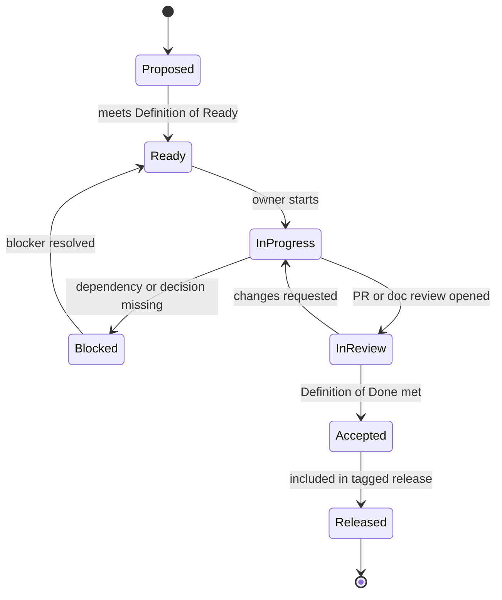

# Agile operating model

This project should run as documentation-led agile delivery: every sprint ships a small, reviewable increment, and every implementation task traces back to a user story, architecture decision, or operational requirement.

## Quick path

1. Keep sprint length at two weeks unless the team explicitly changes it.
2. Use the backlog ID as the stable reference across Markdown, issues, branches, and PRs.
3. Start work only when the item is Ready.
4. Accept work only when the Definition of Done is met.

## Cadence

| Ceremony | Cadence | Output |
|---|---:|---|
| Sprint planning | Start of sprint | Sprint goal, selected backlog items, owners, known risks. |
| Async daily check | Daily | Progress, blockers, next action. |
| Backlog refinement | Mid-sprint | Ready items for the next sprint. |
| Architecture checkpoint | Before risky implementation | Decision record, updated diagrams, open questions. |
| Sprint review | End of sprint | Demo, completed acceptance criteria, unresolved work. |
| Retrospective | End of sprint | One process improvement for the next sprint. |

## Roles

| Role | Owns |
|---|---|
| Product / PM | Sprint goal, backlog priority, acceptance criteria, release readiness. |
| Architecture | Clean Architecture boundaries, SOLID contracts, Mermaid diagrams, ADRs. |
| Infrastructure | Docker Compose, installer, environment checks, local services. |
| Data / Accounting | PostgreSQL schema, accounting fields, JSONB strategy, search indexes. |
| Queue / Worker | RabbitMQ routing, retry, DLQ, Redis progress, locks, worker heartbeats. |
| SAT Integration | fake SAT scenarios, signer abstraction, SOAP client, typed SAT errors. |
| Parser | CFDI version detection, complement registry, fixtures, partial parsing behavior. |
| CLI / UX | Typer/Rich commands, help text, progress display, operator messages. |
| QA | Unit, integration, CLI, fake SAT E2E, fixture coverage, acceptance evidence. |

## Work item lifecycle

## Definition of Ready

- [ ] User story, operational need, or foundation document reference exists.
- [ ] Acceptance criteria are testable.
- [ ] Dependencies are listed by backlog ID.
- [ ] Owner role is assigned.
- [ ] Data, queue, storage, installer, or CLI impact is documented when relevant.
- [ ] Error and edge-case behavior is documented or explicitly deferred.
- [ ] The work is small enough for review, or a review-size exception is recorded.

## Definition of Done

- [ ] Code, docs, and tests are updated together when behavior changes.
- [ ] CLI help or operator docs are updated for user-facing commands.
- [ ] Mermaid diagrams are updated when flow or architecture changes.
- [ ] Migration or storage changes include rollback/retention notes.
- [ ] Queue changes include retry, idempotency, and DLQ behavior.
- [ ] Parser changes include fixtures and partial-parse behavior.
- [ ] Tests pass locally.
- [ ] Acceptance criteria are explicitly checked in the PR or sprint review.

## Delegation rules

| Work type | Can run in parallel? | Rule |
|---|---:|---|
| Documentation and diagrams | Yes | Parallel only if each document has one owner. |
| Interfaces / ports | Yes | Architecture owner must review before adapters depend on them. |
| PostgreSQL schema | Partly | Migrations and repository tests can run after the data model is accepted. |
| RabbitMQ / Redis | Yes | Can run beside database work once message contracts are stable. |
| Parser fixtures | Yes | Can start early because fixtures define expected behavior. |
| Fake SAT E2E | No | Waits for storage, database, queue, and parser contracts. |
| Live SAT | No | Waits for security, signer, typed errors, and manual opt-in approval. |
| Installer | Partly | Can start after storage root and Docker Compose contracts are stable. |

## Review budget

Default target: keep each implementation PR near 400 changed lines. If a slice is larger, split it by workstream or record an explicit size exception in the PR.

## Next step

Use [Sprint roadmap](sprint-roadmap.md) to select the next sprint goal.
