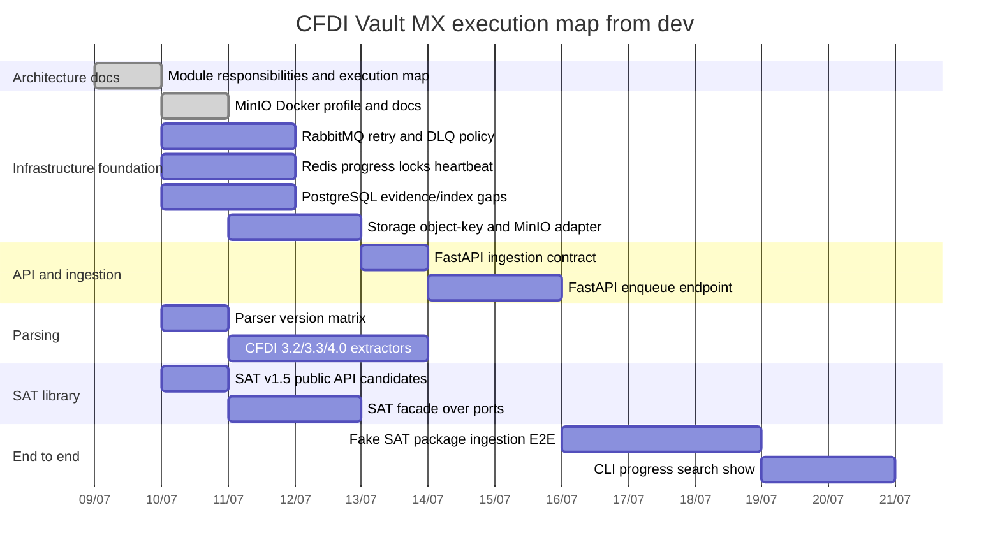

# Architecture execution plan

This plan turns the responsibility map into tomorrow-sized and sprint-sized work units. It
keeps branches reviewable, assigns a worktree per isolated stream, and makes dependencies visible
before agents start coding.

## Decision

Use `dev` as the only integration base. Each implementation stream gets a branch and, when it is
parallel or risky, a dedicated git worktree. Dependent work waits for its base branch to merge into
`dev` unless an explicit stacked branch is approved.

## Quick path for every work unit

1. Start from updated `dev`.
2. Create a branch named by work type: `feature/...`, `fix/...`, `docs/...`, `test/...`, or `chore/...`.
3. Use a git worktree for parallel/isolated work.
4. Keep docs and tests with the work unit.
5. Run targeted tests, full tests when runtime changes, scanners, and `git diff --check`.
6. Open/merge PR to `dev`, then remove the worktree only when safe.

## Gantt-style dependency map

## Parallel vs sequential work

| Workstream | Can run in parallel with | Must wait for | Reason |
|---|---|---|---|
| RabbitMQ retry/DLQ | Redis, DB, parser plan, SAT library plan | Responsibility docs | It owns queue semantics and does not need API implementation first. |
| Redis progress/locks/heartbeat | RabbitMQ, DB, parser plan | Responsibility docs | It owns transient state and worker observability. |
| PostgreSQL evidence/index gaps | Queue, Redis, parser plan | Responsibility docs | It defines durable state needed by later API/E2E. |
| Storage object-key + MinIO adapter | Queue, Redis, parser plan | Storage port/object-key decision and optional Docker MinIO profile | API should accept storage references after keys are stable. |
| FastAPI ingestion contract | Parser plan, SAT library plan | Storage reference contract | API payload must know what a valid evidence reference is. |
| Parser version matrix | Queue, Redis, DB | Responsibility docs | Extractor design can progress before API implementation. |
| Parser implementation | SAT library facade | Parser matrix and evidence schema | Writes parser status and accounting payloads. |
| SAT v1.5 library facade | Queue/Redis work | Domain/results/ports promoted | Library should stay runtime-agnostic. |
| Fake SAT E2E | None, it is integration work | Queue, Redis, DB, API, parser baseline | It proves the whole chain and should not start early. |
| CLI progress/search/show | Docs polish | Fake E2E and DB/query state | CLI should display real states, not invented placeholders. |

## Work unit backlog

| ID | Branch | Type | Owner role | Scope | Depends on | Acceptance |
|---|---|---|---|---|---|---|
| ARCH-EXEC-001 | `docs/architecture-execution-map` | docs/infra | Architecture | Module responsibilities, MinIO boundary/profile, Gantt/worktree plan. | `dev` | Docs scanners, Compose config, and markdown diff check pass. |
| QUEUE-003 | `feature/rabbitmq-retry-dlq-worker` | feature | Queue/Worker | Exchanges/routing, retry count, DLQ, worker retry events. | ARCH-EXEC-001 | Queue tests prove retry and DLQ without raw payloads. |
| CACHE-002 | `feature/redis-progress-locks-heartbeat` | feature | Queue/Worker | Progress keys, locks, heartbeat, stale worker reporting. | ARCH-EXEC-001 | Redis adapter tests and worker status tests pass. |
| DB-005 | `feature/postgres-evidence-indexes` | feature | Data | Evidence metadata, parser status, search indexes as Flyway migrations. | ARCH-EXEC-001 | Migration/repository tests pass; no runtime create-all shortcut. |
| STOR-004 | `feature/storage-object-minio-adapter` | feature | Storage | Storage port object keys, filesystem adapter parity, MinIO adapter behind the optional lab. | ARCH-EXEC-001 | Filesystem and MinIO adapter tests pass; MinIO remains optional/reference-system-only. |
| API-001 | `feature/api-ingestion-contract` | feature | API | Request/response contract for stored references. | STOR-004 | Tests reject raw XML/ZIP/secrets and accept storage refs. |
| API-002 | `feature/api-ingestion-endpoint` | feature | API | FastAPI endpoint validates refs and enqueues `cfdi.parse.xml`. | API-001, QUEUE-003 | Endpoint tests prove no inline parser/bulk DB load. |
| PARSER-001 | `feature/parser-version-matrix` | feature | Parser | Matrix for CFDI 3.2/3.3/4.0, unknown, payments, payroll. | ARCH-EXEC-001 | Fixture matrix docs/tests define complete vs partial. |
| PARSER-002 | `feature/cfdi-version-extractors` | feature | Parser | Version-specific extractors and complement registry behavior. | PARSER-001, DB-005 | Parser tests store version/status/accounting payload. |
| LIB-001 | `feature/sat-v15-public-api-contract` | feature/docs | Library | Supported imports, errors, ports, result models. | ARCH-EXEC-001 | Import smoke and public API docs list supported names. |
| LIB-002 | `feature/sat-v15-library-facade` | feature | Library | `cfdi_vault.sat_download` facade over injected ports. | LIB-001 | Facade works with fake/offline adapters, no runtime dependency. |
| PIPE-003 | `feature/fake-sat-ingestion-e2e` | feature | Application | Fake SAT package to storage to API/queue to parser to DB to reconciliation. | QUEUE-003, CACHE-002, DB-005, API-002, PARSER-002 | E2E proves reprocessability and operator-visible status. |
| CLI-005 | `feature/cli-progress-search-show` | feature | CLI/UX | Progress dashboard, storage locate, search/show status. | PIPE-003 | CLI tests show status without sensitive leakage. |

## Worktree plan

Keep at most three active implementation worktrees unless a final audit justifies more.

| Wave | Worktrees allowed | Branches |
|---|---:|---|
| Wave 1 | 3 | `feature/rabbitmq-retry-dlq-worker`, `feature/redis-progress-locks-heartbeat`, `feature/postgres-evidence-indexes` |
| Wave 2 | 3 | `feature/storage-object-minio-adapter`, `feature/api-ingestion-contract`, `feature/parser-version-matrix` |
| Wave 3 | 3 | `feature/api-ingestion-endpoint`, `feature/cfdi-version-extractors`, `feature/sat-v15-public-api-contract` |
| Wave 4 | 2 | `feature/sat-v15-library-facade`, `feature/fake-sat-ingestion-e2e` |
| Wave 5 | 1 | `feature/cli-progress-search-show` |

Each worktree report must include branch, base, files changed, tests, merge status, and cleanup recommendation.

## Merge gate

- [ ] Branch is based on `dev` or explicitly stacked with documented dependency.
- [ ] PR target is `dev`.
- [ ] No unrelated branch changes are staged.
- [ ] Targeted tests pass.
- [ ] Full pytest passes for runtime changes.
- [ ] Sensitive fixture scanner passes.
- [ ] SAT context scanner passes when SAT docs/code change.
- [ ] `git diff --check` passes.
- [ ] Worktree cleanup is documented after merge.
