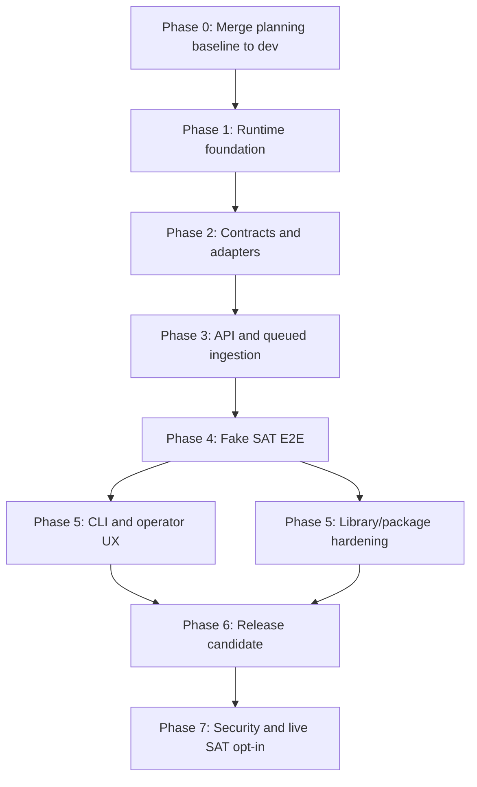
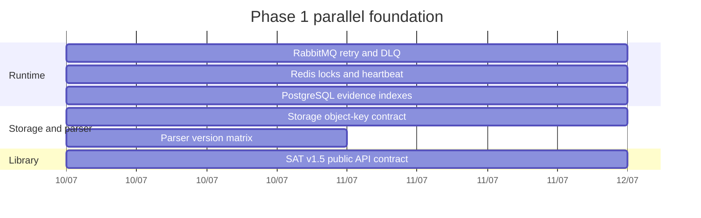

# Implementation master plan

This is the delivery presentation for finishing the CFDI Vault MX recovery system from the current `dev` base. It converts the architecture map into phased work that agents can execute in isolated branches/worktrees, with explicit dependencies, merge gates, and a dedicated library/package track.

## Decision

Build the system in reviewable waves from `dev`. Keep the reference system and the reusable Python library aligned, but do not confuse them: Docker, PostgreSQL, RabbitMQ, Redis, MinIO, FastAPI, and CLI orchestration belong to the reference system; stable importable contracts belong to the library.

## Executive path

1. Merge the architecture/docs/MinIO branch into `dev` after review.
2. Run the next work from `dev`, one branch per feature or fix.
3. Execute independent foundation streams in parallel: queue, cache, database, storage, parser plan, and library public API contract.
4. Start API and end-to-end ingestion only after storage references and queue contracts exist.
5. Promote library APIs only after the quality contract, tests, docs, and package smoke checks are satisfied.
6. Keep live SAT disabled until fake/offline E2E, signer policy, typed errors, and manual gates are accepted.

## Delivery topology

## Agent roster

| Agent role | Primary branch family | Owns | Must coordinate with | Must not do |
|---|---|---|---|---|
| Architecture lead | `docs/...` | Diagrams, boundaries, phase gates, sprint review evidence. | Every stream before cross-layer changes. | Implement code without a backlog item. |
| Data agent | `feature/postgres-...` | Flyway migrations, evidence metadata, accounting/search indexes, repository tests. | Storage, parser, API. | Store raw XML/ZIP bytes in PostgreSQL. |
| Storage agent | `feature/storage-...` | Storage port, object keys, filesystem parity, MinIO adapter tests. | Data, API, worker. | Make MinIO a required library/runtime dependency. |
| Queue/worker agent | `feature/rabbitmq-...` | RabbitMQ exchanges, routing keys, retry, DLQ, worker job contracts. | Cache, API, data. | Put raw XML, ZIPs, SOAP bodies, or secrets on queues. |
| Cache/worker agent | `feature/redis-...` | Redis progress, locks, heartbeat, stale worker detection. | Queue, CLI. | Treat Redis as source of truth. |
| API agent | `feature/api-...` | FastAPI stored-reference contract and enqueue endpoint. | Storage, queue, data. | Parse XML or bulk-load accounting rows inline. |
| Parser agent | `feature/parser-...` | CFDI version detector, extractors, complement registry, fixture matrix. | Data, storage, QA. | Delete evidence or hide unknown complements. |
| SAT library agent | `feature/sat-v15-...` | Import-first SAT v1.5 public facade, typed results, ports, fake/offline adapters. | Architecture, QA, release. | Promote live probes or e.firma handling as stable API. |
| CLI/UX agent | `feature/cli-...` | Progress, status, storage locate, search/show/export UX. | Queue, cache, data. | Put business rules back into `src/cfdi_vault/cli.py`. |
| QA/security agent | `test/...`, `chore/...` | Fixture scanner coverage, no-real-data gates, integration evidence, release checks. | All streams. | Approve sensitive fixtures or live SAT without human gate. |
| Integration maintainer | `dev` only through PRs | Merge order, CI gates, worktree cleanup, release branch readiness. | All owners. | Merge dirty, untested, or unrelated work. |

## Phase 0: Planning baseline and branch hygiene

| Item | Type | Owner | Branch | Output | Acceptance |
|---|---|---|---|---|---|
| ARCH-EXEC-001 | docs/infra | Architecture lead | `docs/architecture-execution-map` | Responsibility map, MinIO profile, execution plan, master plan. | Branch policy, scanners, Compose config, docs diff check, tests when run. |
| DEV-GATE-001 | chore | Integration maintainer | `dev` | Confirm `dev` equals `origin/dev`, clean tree, no stale worktree contamination. | `git fetch`, `git status -sb`, branch policy pass. |
| PLAN-REVIEW-001 | docs | Architecture lead | same PR | Review this plan against backlog and team board. | Sprint candidate board reflects the first execution wave. |

### Phase 0 merge gate

- [ ] PR targets `dev`.
- [ ] No old branch is merged just because it has recent commits.
- [ ] `docker compose config` passes.
- [ ] `docker compose --profile object-storage config` passes.
- [ ] Sensitive fixture scanner passes.
- [ ] SAT context scanner passes if SAT docs are touched.
- [ ] `git diff --check` passes.
- [ ] Full test suite is run when runtime files changed.

## Phase 1: Runtime foundation sprint

Goal: make each infrastructure primitive reliable enough that higher-level API and E2E work does not become a giant script.

| Item | Type | Agent | Branch/worktree | Depends on | Tasks | Acceptance |
|---|---|---|---|---|---|---|
| QUEUE-003 | feature | Queue/worker | `feature/rabbitmq-retry-dlq-worker` | ARCH-EXEC-001 | Define exchanges, routing keys, message envelope, retry counters, DLQ routing, PostgreSQL queue-event audit shape. | Tests prove bounded retry, DLQ, idempotency key, and no raw fiscal payloads. |
| CACHE-002 | feature | Cache/worker | `feature/redis-progress-locks-heartbeat` | ARCH-EXEC-001 | Define progress key schema, criteria locks, worker heartbeat, stale worker read model. | Tests prove transient progress can disappear without losing durable job state. |
| DB-005 | feature | Data | `feature/postgres-evidence-indexes` | ARCH-EXEC-001 | Add/adjust Flyway migrations for evidence metadata, parser status, reconciliation/search indexes. | Migration/repository tests pass; no runtime `create_all` shortcut. |
| STOR-004A | feature | Storage | `feature/storage-object-key-contract` | ARCH-EXEC-001 | Define storage key value object, evidence metadata shape, filesystem adapter parity tests. | XML/ZIP storage keys are deterministic, hash-aware, and tenant/RFC/period aware. |
| PARSER-005A | feature/docs | Parser | `feature/parser-version-matrix` | ARCH-EXEC-001 | Define fixture matrix for CFDI 3.2, 3.3, 4.0, unknown version, payments, payroll, unknown complements. | Parser scope and partial/complete rules are documented and fixture-safe. |
| LIB-005A | feature/docs | SAT library | `feature/sat-v15-public-api-contract` | ARCH-EXEC-001 | Define supported imports, result models, public errors, source policy, and internal/live exclusions. | Public API doc matches library quality contract and import smoke expectations. |

### Phase 1 parallel plan

## Phase 2: Contracts and adapters sprint

Goal: convert foundation contracts into tested adapters. The API contract remains blocked on the Phase 1 storage, queue, PostgreSQL, and Redis gates; API implementation and E2E also wait for the Phase 2 worker/progress adapters.

| Item | Type | Agent | Branch/worktree | Depends on | Tasks | Acceptance |
|---|---|---|---|---|---|---|
| STOR-004B | feature | Storage | `feature/storage-object-minio-adapter` | STOR-004A | Implement MinIO adapter behind storage port, configure test profile, prove filesystem/MinIO parity with synthetic bytes. | MinIO remains optional; app/worker are not forced to depend on it. |
| QUEUE-004 | feature | Queue/worker | `feature/worker-job-envelope` | QUEUE-003, DB-005 | Worker consumes typed job envelopes, writes durable state, reports retry reason. | Worker tests show retryable/non-retryable split and queue audit rows. |
| CACHE-003 | feature | Cache/worker | `feature/worker-progress-read-model` | CACHE-002, QUEUE-004 | Bridge worker heartbeat/progress to status read model. | CLI/API can query progress without reading Redis as source of truth. |
| PARSER-005B | feature | Parser | `feature/cfdi-version-detector` | PARSER-005A, DB-005 | Implement version detector, version-specific extractors, complement registry, and partial/unknown behavior. | Synthetic fixture tests cover 3.2/3.3/4.0/unknown, known/unknown complements, and complete/partial status. |
| LIB-005B | feature | SAT library | `feature/sat-v15-result-models` | LIB-005A | Add typed request/result/error models, fake readers/adapters, and offline contract tests. | Public models and fakes have type hints, docstrings, offline tests, and no external-service or live-SAT side effects. |

## Phase 3: API and queued ingestion sprint

Goal: make stored evidence enter the processing pipeline through a short API transaction and queue handoff.

| Item | Type | Agent | Branch/worktree | Depends on | Tasks | Acceptance |
|---|---|---|---|---|---|---|
| API-003A | feature | API | `feature/api-ingestion-contract` | STOR-004A, QUEUE-003, DB-005, CACHE-002 | Define request/response schema for stored XML/package references, idempotency key, tenant/job correlation only after every Phase 1 runtime contract is stable. | Tests reject raw XML, ZIP bytes, secrets, SOAP bodies, and e.firma material; filesystem parity, queue reliability, indexed evidence, and consistent progress semantics are proven. |
| API-003B | feature | API | `feature/api-ingestion-endpoint` | API-003A, QUEUE-004, CACHE-003 | Implement FastAPI endpoint that validates evidence reference and publishes `cfdi.parse.xml`. | Endpoint returns correlation id and does not parse XML inline. |
| WORKER-002 | feature | Queue/worker | `feature/xml-parse-worker` | API-003B, PARSER-005B | Worker reads XML by storage key and calls parser registry. | Worker writes parser status and retry/manual-review state. |
| DB-006 | feature | Data | `feature/accounting-write-model` | DB-005, PARSER-005B | Persist normalized accounting rows and JSONB complement payloads. | Repository tests prove idempotent UUID/version writes. |
| LIB-005C | feature | SAT library | `feature/sat-v15-facade` | LIB-005B | Add import-first facade over injected ports/fakes. | Consumer import smoke works without Docker, PostgreSQL, RabbitMQ, Redis, or live SAT. |

## Phase 4: Fake SAT end-to-end sprint

Goal: prove the full safe path before live SAT or release promises.

| Item | Type | Agent | Branch/worktree | Depends on | Tasks | Acceptance |
|---|---|---|---|---|---|---|
| PIPE-003 | feature | Integration maintainer | `feature/fake-sat-ingestion-e2e` | STOR-004A, QUEUE-004, CACHE-003, DB-005, DB-006, API-003B, PARSER-005B, WORKER-002 | Fake SAT package to filesystem storage, API enqueue, worker parse, PostgreSQL write, reconciliation status only after all runtime gates are stable. | E2E proves evidence-first flow, indexed evidence, consistent progress, and reprocessability from stored XML without requiring optional MinIO. |
| REC-002 | feature | Data/parser | `feature/reconciliation-events` | PIPE-003 | Add missing XML, duplicate UUID, partial parser, cancelled/unavailable events. | Reconciliation events are operator-visible and tested. |
| QA-003 | test | QA/security | `test/fake-sat-e2e-fixture-gates` | PIPE-003 | Expand scanners and integration fixtures for no-real-data policy. | Scanner blocks real-looking RFCs, certificates, secrets, XML/ZIP evidence. |
| DOC-PIPE-001 | docs | Architecture lead | same phase PR or docs branch | PIPE-003 | Update diagrams/runbook with verified E2E behavior. | Docs match tested behavior, not planned behavior. |

## Phase 5A: Operator UX sprint

Goal: make the system usable from the CLI without hiding architecture behind one monolith.

| Item | Type | Agent | Branch/worktree | Depends on | Tasks | Acceptance |
|---|---|---|---|---|---|---|
| CLI-005A | feature | CLI/UX | `feature/cli-progress-status` | CACHE-003, PIPE-003 | Add progress/status commands reading durable state plus transient heartbeat. | CLI shows active/stale workers and job progress without leaking sensitive data. |
| CLI-005B | feature | CLI/UX | `feature/cli-storage-locate` | STOR-004A, DB-005 | Add `storage status` and `storage locate` user flow. | User can find XML/package evidence and hashes from stored references. |
| CLI-005C | feature | CLI/UX | `feature/cli-search-show-export` | DB-006, REC-002 | Add search/show/export polish and partial-parser warnings. | CLI tests cover filters, redaction, empty states, and partial parse warnings. |
| ERR-002 | fix/feature | CLI/UX + QA | `feature/actionable-errors` | PIPE-003 | Normalize user-facing errors with next actions. | Common errors say what failed, why it matters, and what to do next. |

## Phase 5B: Library/package hardening sprint

Goal: make the reusable library credible before any public release.

| Item | Type | Agent | Branch/worktree | Depends on | Tasks | Acceptance |
|---|---|---|---|---|---|---|
| LIB-006 | feature/docs | SAT library | `feature/library-public-api-audit` | LIB-005C | Audit `cfdi_vault` exports, classify public/internal/experimental/reference-only modules. | `docs/release/public-api.md` lists every supported import and exclusions. |
| LIB-007 | feature | SAT library | `feature/library-consumer-example` | LIB-006 | Add minimal consumer example using fake/offline APIs outside Docker. | Example imports package APIs without reference-system runtime services. |
| REL-003A | chore/docs | Release | `chore/package-metadata-readiness` | LIB-006 | Verify metadata, classifiers, license, README claims, package data. | Build metadata is honest and alpha/case-study wording is consistent. |
| REL-003B | chore/test | Release + QA | `chore/package-build-smoke` | REL-003A | Build sdist/wheel, `twine check`, clean venv install, console script smoke. | Package artifacts install and scanner/tests pass. |
| REL-004A | release | Release | `release/testpypi-alpha-smoke` | REL-003B | Configure TestPyPI Trusted Publishing and install smoke. | TestPyPI smoke passes before production PyPI. |

### Library-specific API guardrails

| Surface | Public only when | Required tests/docs |
|---|---|---|
| `cfdi_vault.domain` | Stable domain invariants and serialization are documented. | Unit tests for valid/invalid/hash/serialization behavior. |
| `cfdi_vault.ports` | Interfaces are runtime-agnostic and do not import adapters. | Fake implementations prove contracts. |
| `cfdi_vault.sat_download` | Facade delegates to injected ports and fake/offline adapters by default. | Fake transport tests, typed errors, no-live-CI guard. |
| Parser API | Version/partial behavior is explicit and fixture-safe. | Synthetic CFDI 3.2/3.3/4.0/unknown/complement tests. |
| Storage API | Evidence keys are deterministic and bytes are stored before parsing. | Filesystem and MinIO adapter parity tests. |
| CLI | Command is documented as reference-system interface unless explicitly promoted. | Typer tests, help text, redaction checks. |

## Phase 6: Release candidate sprint

Goal: freeze a coherent alpha candidate that is honest about maturity and safe by default.

| Item | Type | Agent | Branch/worktree | Depends on | Tasks | Acceptance |
|---|---|---|---|---|---|---|
| REL-005 | docs/chore | Release | `release/alpha-rc-checklist` | Phase 5A, Phase 5B | Contribution guide, changelog, release notes, known limitations, install smoke runbook. | RC checklist has evidence links for tests, scanners, build, docs, and examples. |
| QA-004 | test | QA/security | `test/release-regression-matrix` | REL-005 | Full regression matrix for CLI, package, fake E2E, scanners, Docker config. | Release gate is reproducible locally and in CI. |
| DOC-REL-001 | docs | Docs/release | `docs/release-alpha-positioning` | REL-005 | README and release docs state fake/offline alpha limitations and support path. | No production/live SAT claims. |

## Phase 7: Security and live SAT opt-in sprint

Goal: only after fake/offline and release safety are proven, design the live SAT path with explicit human gates.

| Item | Type | Agent | Branch/worktree | Depends on | Tasks | Acceptance |
|---|---|---|---|---|---|---|
| SEC-001 | docs/feature | Security | `feature/credential-custody-policy` | Phase 4 | Define credential custody, signer port, redacted audit, local secret provider behavior. | No plaintext secret storage; human gate documented. |
| SAT-002 | feature | SAT integration | `feature/sat-signer-soap-boundary` | SEC-001, LIB-005C | Implement signer/SOAP boundaries with fake transport and typed errors. | No live SAT in CI; live code is opt-in and testable with fakes. |
| SAT-003 | docs/test | SAT integration + QA | `docs/manual-live-sat-runbook` | SAT-002 | Manual live runbook, evidence redaction, rollback, operator prerequisites. | Maintainer can run one controlled live gate outside CI only after approval. |

## Integration and merge rhythm

| Step | Rule | Command/evidence |
|---|---|---|
| Start | Branch from updated `dev`. | `git fetch origin`, `git switch dev`, `git pull --ff-only`, `git switch -c feature/...`. |
| Isolation | Use a worktree for parallel or risky work. | `git worktree add ../cfdi-vault-mx-worktrees/<branch> -b <branch> dev`. |
| Local gate | Run targeted tests first, then full tests for runtime changes. | `py -m pytest ...`, `py -m pytest -q`. |
| Safety gate | Always scan before PR/merge. | `py scripts/scan_sensitive_fixtures.py`, `py scripts/scan_sat_context.py` when SAT docs/code changed. |
| Formatting gate | No whitespace debt. | `git diff --check`, `git diff --cached --check`. |
| PR gate | Target `dev`; explain scope, tests, risks, and follow-up. | PR description links backlog IDs. |
| Merge gate | Merge only clean, tested, reviewed, and non-sensitive work. | CI green, no human gate blocker. |
| Cleanup | Remove worktree only after merge into `dev`. | Worktree status clean, `git worktree remove`, `git worktree prune`. |

## Fix lane

Fixes are allowed when they unblock a feature gate, CI, scanner, or documented architecture rule.

| Fix type | Branch | Rule | Acceptance |
|---|---|---|---|
| CI/test failure | `fix/<specific-ci-failure>` | Minimal change; no opportunistic refactor. | Failing test plus impacted gate passes. |
| Scanner/security finding | `fix/<scanner-finding>` | Stop if sensitive data is found; ask Carlos if real data/secrets are involved. | Scanner passes and evidence is removed safely. |
| Merge conflict | `fix/<area>-merge-conflict` | Preserve split CLI adapters and architecture boundaries. | Conflict resolved, targeted tests, scanners, diff check. |
| Documentation inconsistency | `docs/<specific-correction>` | Correct source-of-truth docs and cross-links. | Docs line up with code and current plan. |

## Definition of Done for every feature

- [ ] Branch started from `dev` or documented as stacked.
- [ ] One clear backlog ID or Sprint Packet exists.
- [ ] Architecture boundary did not move silently.
- [ ] Code, tests, and docs changed together when behavior changed.
- [ ] No real CFDI, SAT metadata, ZIP, XML, certificate, key, token, password, RFC, or local secret path was introduced.
- [ ] Targeted tests pass.
- [ ] Full tests pass for runtime changes.
- [ ] Sensitive fixture scanner passes.
- [ ] SAT context scanner passes when SAT behavior/docs changed.
- [ ] `git diff --check` and `git diff --cached --check` pass.
- [ ] PR targets `dev` and explains risks/follow-up.

## What can start tomorrow

| Priority | Start | Why now | Parallel with |
|---:|---|---|---|
| 1 | Merge `docs/architecture-execution-map` to `dev`. | Everyone needs the same planning baseline. | Nothing; this is the gate. |
| 2 | `feature/rabbitmq-retry-dlq-worker`. | Queue semantics unblock worker/API/E2E. | Redis, DB, parser plan, library plan. |
| 3 | `feature/redis-progress-locks-heartbeat`. | Progress/heartbeat makes workers observable. | Queue, DB, storage. |
| 4 | `feature/postgres-evidence-indexes`. | Durable evidence/accounting state is the backbone. | Queue, Redis, parser plan. |
| 5 | `feature/storage-object-key-contract`. | API must receive stable evidence references. | Queue, Redis, parser plan, library plan. |
| 6 | `feature/parser-version-matrix`. | Parser scope needs to be known before extraction code. | Runtime foundation streams. |
| 7 | `feature/sat-v15-public-api-contract`. | Library work must be designed before public imports are promoted. | Runtime foundation streams. |

## Next review checkpoint

After Phase 1 branches are opened, review these questions before allowing Phase 2:

- Are queue messages reference-only and idempotent?
- Can Redis be deleted without losing recovery truth?
- Do PostgreSQL tables know where evidence lives without storing raw XML/ZIP bytes?
- Are storage keys stable across filesystem and future MinIO adapters?
- Does the parser matrix define complete, partial, unknown, and manual-review behavior?
- Does the library public API avoid Docker/PostgreSQL/RabbitMQ/Redis/live-SAT assumptions?
