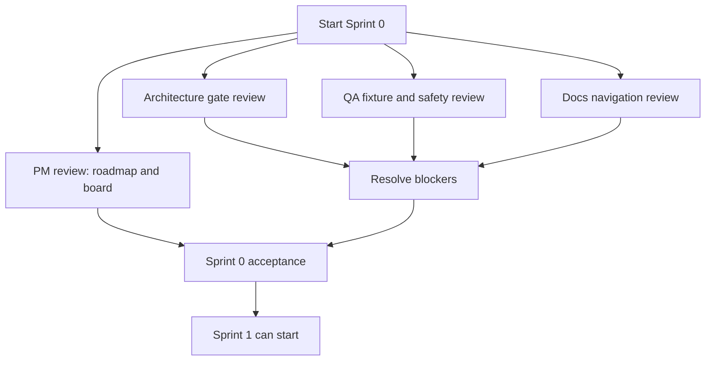

# Sprint 0 execution plan

Sprint 0 exists to prevent implementation chaos. Its output is not production code; its output is permission to start Sprint 1 with clear ownership, risks, and acceptance criteria.

## Decision

Sprint 0 is active when the team starts reviewing the foundation and planning artifacts. Sprint 1 must not start until Sprint 0 acceptance criteria are checked.

## Quick path

1. Assign the four Sprint 0 backlog items.
2. Run architecture, QA, and docs reviews in parallel.
3. Update open questions or backlog when blockers are found.
4. Accept Sprint 0 only when Sprint 1 has no unknown blocker.

## Sprint goal

Confirm that the repository has enough foundation, planning, ownership, and safety documentation to begin Sprint 1 without creating avoidable technical debt.

## Scope

| ID | Title | Owner role | Execution mode | Output |
|---|---|---|---|---|
| PM-001 | Accept sprint roadmap and workstream ownership | Product / PM | Sequential lead | Sprint goal, scope, and board accepted. |
| ARCH-001 | Review foundation gate before new code | Architecture | Parallel review | Sprint 1 blockers and missing decisions identified. |
| QA-001 | Define fixture policy and no-real-CFDI rule | QA | Parallel review | Fixture policy gaps and no-real-CFDI acceptance criteria identified. |
| DOC-001 | Link planning docs from main documentation index | Docs | Parallel review | Navigation and documentation links verified. |

## Parallel execution



## Agent assignments

| Agent role | Backlog ID | Assignment | Must not do |
|---|---|---|---|
| Architecture reviewer | ARCH-001 | Review foundation gate, dependency map, open questions, and Sprint 1 blockers. | Do not implement Sprint 1 code. |
| QA / fixture reviewer | QA-001 | Review fixture policy, fake-data safety, and no-real-CFDI risk. | Do not add real CFDI files. |
| PM / docs reviewer | PM-001, DOC-001 | Review planning completeness, navigation, and board status. | Do not change scope without updating backlog. |
| Sprint lead | All Sprint 0 | Merge review findings into board, backlog, and open questions. | Do not mark Sprint 0 accepted without evidence. |

## Handoff prompts

Use these prompts when assigning work to agents or teammates.

### Architecture reviewer

```text
Review ARCH-001 for CFDI Vault MX Sprint 0.
Read docs/foundation/README.md, architecture-blueprint.md, flows-and-states.md,
data-and-accounting-model.md, open-questions.md, workstream-ownership.md,
docs/planning/sprint-roadmap.md, backlog.md, and team-board.md.
Return Sprint 1 blockers, missing decisions, and whether Sprint 1 can start.
Do not edit files.
```

### QA / fixture reviewer

```text
Review QA-001 for CFDI Vault MX Sprint 0.
Read docs/security-model.md, docs/foundation/open-questions.md,
docs/planning/backlog.md, docs/planning/team-board.md, examples/, and tests/.
Return fixture policy gaps, no-real-CFDI risks, and acceptance criteria.
Do not add real taxpayer data.
```

### PM / docs reviewer

```text
Review PM-001 and DOC-001 for CFDI Vault MX Sprint 0.
Read README.md, docs/README.md, docs/foundation/README.md, and docs/planning/.
Return whether the plan is finite enough to start Sprint 0, navigation gaps,
and recommended board status updates.
Do not edit files.
```

## Acceptance criteria

- [ ] PM-001 has an accepted roadmap, backlog, and Sprint 0 board.
- [ ] ARCH-001 confirms Sprint 1 has no unknown blocker, or blockers are captured.
- [ ] QA-001 confirms fixture policy and no-real-CFDI rules are explicit enough for Sprint 1.
- [ ] DOC-001 confirms planning navigation is discoverable from the root README and docs index.
- [ ] Any new ambiguity is added to `docs/foundation/open-questions.md`.
- [ ] Any new work is added to `docs/planning/backlog.md`.
- [ ] Sprint 1 candidate board is updated with only Ready work.

## Exit decision

Sprint 0 can close only with one of these outcomes:

| Outcome | Meaning |
|---|---|
| Accepted | Sprint 1 can start. |
| Accepted with tracked blockers | Sprint 1 can start only for items not blocked. |
| Not accepted | Continue planning; do not start Sprint 1 implementation. |

## Next step

Collect reviewer findings in [Sprint 0 review findings](sprint-0-review-findings.md), then update [Team board](team-board.md).
