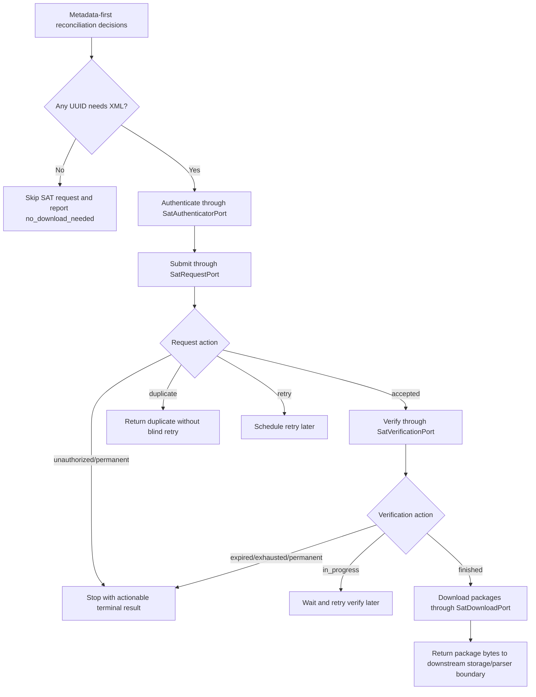

# Sprint 3: SAT contract layer and simulated orchestration

Sprint 3 builds the non-live SAT contract boundary and a deterministic simulator for the mass-download flow. It proves request, verification, package download, SAT-code classification, and metadata-first orchestration without touching real SAT access or real fiscal evidence.

## Quick path

1. Keep all SAT behavior behind ports.
2. Drive package download decisions from existing metadata-first reconciliation rules.
3. Use synthetic fake SAT scenarios for every contract test.
4. Stop before live SOAP, e.firma, certificate custody, or real network integration.

## Goal

Create the contractual and simulated orchestration layer needed before any live SAT adapter is designed.

## Scope

| ID | Outcome |
|---|---|
| `SAT-001` | Define ports/interfaces for SAT authentication, request, verification, package download, and CFDI status boundary. |
| `SAT-002` | Add deterministic fake SAT scenarios for accepted, duplicate, unauthorized, in-process, finished, expired, exhausted, and retryable outcomes. |
| `ERR-001` | Classify SAT codes/states into internal actions: retry, permanent failure, expired, unauthorized, duplicate, accepted, in progress, finished, and exhausted. |
| `ORCH-001` | Add simulated orchestration that submits, verifies, and downloads only when metadata-first decisions require XML recovery. |
| `QA-004` | Cover the contract with synthetic SOAP/XML-like payloads and scanner-safe fixtures. |

## Out of scope

- Real SAT SOAP network calls.
- Real e.firma usage.
- Real certificates, keys, or certificate bundles.
- Real CFDI XML, SAT metadata, or SAT ZIP packages.
- Secrets, passwords, tokens, KMS, Vault, or production credential custody.
- Database schema, storage layout, migrations, or RabbitMQ/Redis adapter changes.

## Flow



## Contract boundaries

| Port | Responsibility | Must not do |
|---|---|---|
| `SatAuthenticatorPort` | Return a normalized short-lived auth result for SAT operations. | Store e.firma material or expose secrets. |
| `SatRequestPort` | Submit one normalized `DownloadQuery` and return SAT request outcome. | Download packages or parse XML. |
| `SatVerificationPort` | Check a SAT request and return state/package ids. | Decide local reconciliation. |
| `SatDownloadPort` | Download one package by package id. | Extract XML or write durable evidence. |
| `CfdiStatusClientPort` | Query CFDI status only when reconciliation asks for confirmation. | Replace metadata parsing or local ledger rules. |

## Acceptance criteria

- [ ] Interfaces exist for authentication, request, verification, download, and status consultation boundary.
- [ ] Fake SAT scenarios cover accepted, duplicate, unauthorized, in-process, finished with packages, package expired, downloads exhausted, and retryable internal error.
- [ ] SAT outcomes are mapped to stable internal actions.
- [ ] Orchestration uses existing metadata-first decisions.
- [ ] Orchestration skips XML download when reconciliation says it is unnecessary.
- [ ] Contract tests use synthetic SOAP/XML-like payloads only.
- [ ] Sensitive fixture scanner passes.
- [ ] Pytest passes.
- [ ] `git diff --check` passes.

## Validation plan

```powershell
.\.venv\Scripts\python.exe scripts\scan_sensitive_fixtures.py
.\.venv\Scripts\python.exe -m pytest -q
cmd /c "git diff --check"
```

## Security checklist

- [ ] No real SAT network call is introduced.
- [ ] No real CFDI XML, metadata, or package fixture is introduced.
- [ ] No certificate/key/bundle files are added.
- [ ] No secrets, tokens, passwords, private keys, fingerprints, or local config are committed.
- [ ] Synthetic RFC-like values remain restricted to scanner allow-list values.
- [ ] Synthetic UUID-like values remain restricted to scanner allow-list patterns.

## Review notes

This sprint is intentionally contract-first. The fake client may return package bytes, but it does not represent SAT ZIP evidence and does not write files. Durable storage and XML parsing remain downstream responsibilities already covered by earlier slices.
