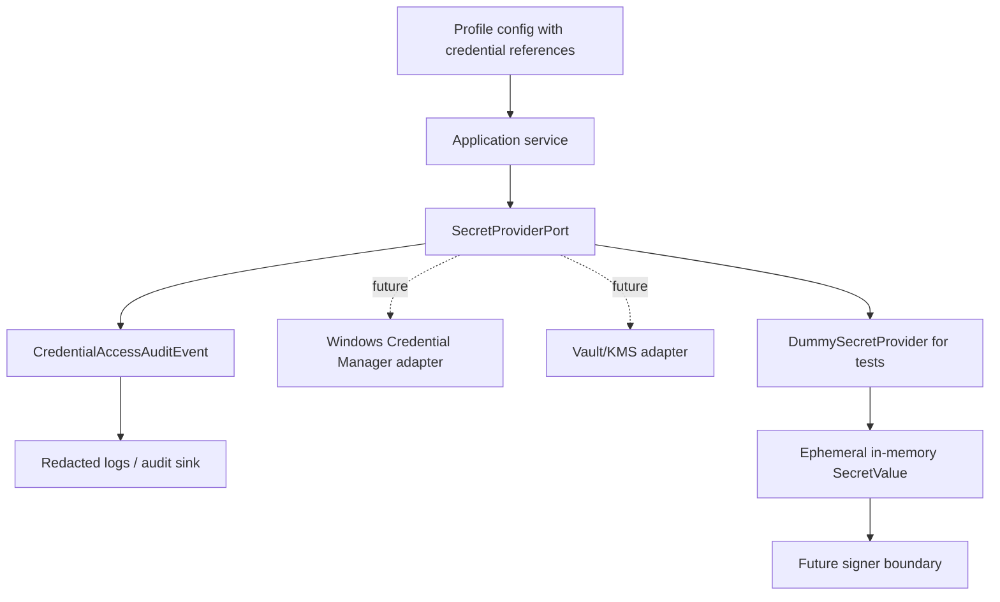

# Sprint 4: e.firma custody threat model and local secret boundary

Carlos explicitly approved this Sprint Packet for Sprint 4. The sprint defines the secure local boundary for e.firma and credential custody without introducing real credentials, certificate files, SAT access, or fiscal data.

## Quick path

1. Keep config as references only.
2. Resolve credential material only through a `SecretProvider` boundary.
3. Emit audit metadata without credential values.
4. Use `DummySecretProvider` only for synthetic tests.
5. Stop before real Windows Credential Manager, KMS, Vault, live SAT, or real e.firma access.

## Goal

Design and implement the local custody boundary needed before any live signing or SAT authentication adapter can exist.

## Scope

| ID | Outcome |
|---|---|
| `SEC-001` | Document the local e.firma custody threat model. |
| `SECRET-001` | Define a `SecretProvider` port/interface. |
| `SECRET-002` | Implement a safe `DummySecretProvider` for tests. |
| `WIN-001` | Document the Windows Credential Manager boundary without production integration. |
| `AUDIT-001` | Define audit events for credential reference access and use. |
| `QA-005` | Test that config, logs, fixtures, and storage do not persist credential values. |

## Out of scope

- Real e.firma access.
- Real certificate, key, bundle, or PEM files.
- Real passphrases, passwords, tokens, private keys, or credential values.
- Real SAT access or SOAP integration.
- Real CFDI XML, SAT metadata, or SAT ZIP packages.
- Production Windows Credential Manager integration.
- Production KMS or Vault integration.
- Irreversible schema, storage, or security changes.
- Sprint 5.

## Architecture boundary



## Acceptance criteria

- [ ] Threat model is documented.
- [ ] Windows Credential Manager boundary is documented.
- [ ] `SecretProvider` boundary exists.
- [ ] Dummy provider exists for tests only.
- [ ] Config uses credential references, not credential values.
- [ ] Logs and audit records do not include credential values.
- [ ] Storage and fixtures do not include credential values.
- [ ] Sensitive fixture scanner passes.
- [ ] Pytest passes.
- [ ] `git diff --check` passes.
- [ ] PR or stacked PRs are created and CI is green.

## Validation plan

```powershell
.\.venv\Scripts\python.exe scripts\scan_sensitive_fixtures.py
.\.venv\Scripts\python.exe -m pytest -q
cmd /c "git diff --check"
```

## Security checklist

- [ ] No real e.firma material.
- [ ] No real certificate/key/bundle/PEM files.
- [ ] No real credential values.
- [ ] No real SAT calls.
- [ ] No real fiscal data.
- [ ] No scanner relaxation.
- [ ] No irreversible schema/storage/security change.

## Review notes

This sprint intentionally stops at boundary and dummy behavior. A production Windows Credential Manager adapter remains a later gated security task because it involves platform-specific credential custody and operator runbooks.
