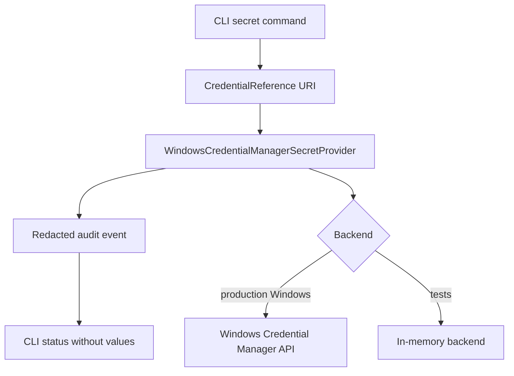

# Sprint 5: Windows secret adapter and credential audit hardening

Carlos explicitly approved this Sprint Packet for Sprint 5. The sprint adds the first Windows-local credential adapter boundary and CLI operations for credential references without using real e.firma, real certificates, real SAT access, or real fiscal data.

## Quick path

1. Keep config as references only.
2. Use Windows Credential Manager only through a provider boundary.
3. Never print resolved credential values.
4. Record audit metadata for create, read, verify, failure, and delete operations.
5. Use injected/fake backends in tests so no real local credentials are required.

## Goal

Implement a minimal, local Windows credential adapter boundary and harden credential audit behavior while preserving the no-real-secret rule.

## Scope

| ID | Outcome |
|---|---|
| `WINSEC-001` | Adjust the Windows Credential Manager boundary for a testable adapter. |
| `WINSEC-002` | Implement a minimal adapter that respects `SecretProviderPort` and can be tested without real secrets. |
| `CLI-SEC-001` | Add CLI commands to register, verify, and delete secret references without printing values. |
| `AUDIT-002` | Add audit metadata for creation, read, failure, verify, and deletion. |
| `QA-006` | Prove redaction, no config exposure, no log exposure, and no storage persistence. |
| `DOC-SEC-001` | Document safe local operation. |

## Out of scope

- Real e.firma material.
- Real certificate, key, bundle, or PEM files.
- Real credential values in tests, docs, fixtures, logs, storage, or config.
- Real SAT access or SOAP integration.
- Real CFDI XML, SAT metadata, or SAT ZIP packages.
- Production KMS or Vault.
- Sprint 6.

## Adapter flow



## Acceptance criteria

- [ ] Adapter respects `SecretProviderPort` by resolving references to redacted `SecretValue` objects.
- [ ] Register/verify/delete CLI commands do not print resolved values.
- [ ] Audit events include action and outcome but not values.
- [ ] Tests use injected synthetic backend, not the real Windows store.
- [ ] Config remains reference-only.
- [ ] Logs do not include resolved values.
- [ ] Storage does not include resolved values.
- [ ] Sensitive fixture scanner passes.
- [ ] Pytest passes.
- [ ] `git diff --check` passes.
- [ ] PRs remain under review budget.

## Validation plan

```powershell
.\.venv\Scripts\python.exe scripts\scan_sensitive_fixtures.py
.\.venv\Scripts\python.exe -m pytest -q
cmd /c "git diff --check"
```

## Security checklist

- [ ] No real credential prompts in tests.
- [ ] No credential values printed to stdout/stderr.
- [ ] No credential values stored in config.
- [ ] No credential values stored in local recovery storage.
- [ ] No scanner relaxation.
- [ ] No live SAT or SOAP code.
