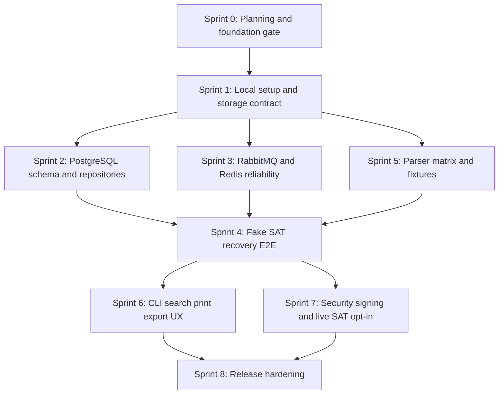

# Sprint roadmap

This roadmap sequences the CFDI recovery library from foundation to release. Sprints are intentionally ordered so parallel work is safe, not chaotic.

## Quick path

1. Complete Sprint 0 before expanding implementation.
2. Run infrastructure, database, queue, parser, and CLI work in parallel only after shared contracts are stable.
3. Delay live SAT work until the fake SAT E2E path, security model, and signer abstraction are proven.

## Dependency map

## Sprint plan

| Sprint | Goal | Parallel lanes | Sequential blockers | Exit criteria |
|---|---|---|---|---|
| 0 | Planning and foundation gate | PM, Architecture, QA | None | Foundation docs, planning docs, open questions, and ownership model are accepted. |
| 1 | Local setup and storage contract | Infrastructure, CLI/UX, Storage | Sprint 0 | Docker Compose path, installer path, storage root, package/XML layout, and `doctor` expectations are documented and validated. |
| 2 | PostgreSQL schema and repositories | Data, QA | Storage contract from Sprint 1 | Migrations, repositories, JSONB strategy, indexes, and integration tests exist. |
| 3 | RabbitMQ and Redis reliability | Queue/Worker, QA | Message contract from Sprint 1 | Exchanges, routing keys, retry, DLQ, progress cache, locks, and worker heartbeat are implemented and tested. |
| 4 | Fake SAT recovery E2E | SAT Integration, Queue/Worker, Data, Storage, QA | Sprints 2, 3, and parser baseline | Fake SAT flow downloads packages, extracts XML, registers evidence, loads PostgreSQL, reconciles, and exposes job status. |
| 5 | Parser matrix and fixtures | Parser, Data, QA | Version/complement scope accepted | CFDI 3.2, 3.3, 4.0, payments, payroll, and unknown complement fixtures prove complete vs partial parsing. |
| 6 | CLI search, print, export, and UX | CLI/UX, Data, QA | Search indexes and E2E data exist | Operators can inspect progress, search invoices, show details, print/export, and understand actionable errors. |
| 7 | Security, signer, and live SAT opt-in | Security, SAT Integration, QA | Fake E2E, typed errors, credential policy | Signer port, credential custody rules, SOAP client, manual live tests, and no-live-CI guard are accepted. |
| 8 | Release hardening | PM, Docs, QA, all owners | Core flows accepted | Installer, docs, examples, contribution guide, changelog, test matrix, and first release candidate are ready. |

## Parallelization plan

| Starts after | Work that can run in parallel |
|---|---|
| Sprint 0 | Installer design, storage implementation, CLI help/UX refinement, parser fixture collection. |
| Sprint 1 | PostgreSQL repositories, RabbitMQ/Redis adapters, parser registry, QA integration harness. |
| Sprint 2 + Sprint 3 | Fake SAT E2E orchestration, search query builder, reconciliation checks. |
| Sprint 4 | CLI progress dashboard, print/export templates, release docs, security hardening preparation. |

## Critical path

1. Foundation gate.
2. Storage root and evidence registration.
3. PostgreSQL migrations and repositories.
4. RabbitMQ/Redis durable worker behavior.
5. Fake SAT end-to-end recovery.
6. CLI operator experience.
7. Security and live SAT opt-in.
8. Release candidate.

## Sprint review checklist

- [ ] Sprint goal met.
- [ ] All accepted work links to backlog IDs.
- [ ] Tests or verification evidence exist.
- [ ] User-facing behavior is reflected in CLI help or docs.
- [ ] Architecture diagrams changed when the system changed.
- [ ] Open questions and blockers are carried into the next sprint.

## Current execution

Sprint 0 starts from [Sprint 0 execution plan](sprint-0-execution.md). Pull Sprint 0 and Sprint 1 candidates from [Backlog](backlog.md).
