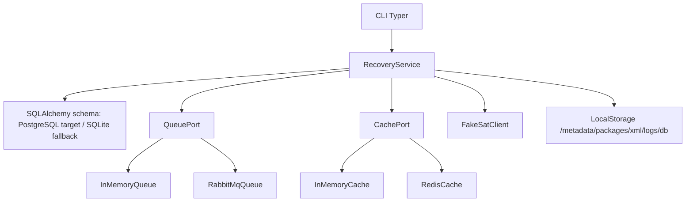
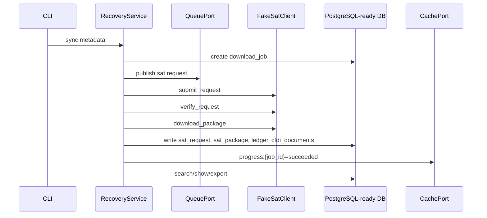

# CFDI recovery v2 implementation slice

This document explains the first implemented slice of the RabbitMQ/Redis/PostgreSQL recovery plan. It gives contributors a quick path first, then the architecture details.

## Quick path

```bash
python -m pip install -e ".[dev]"
cfdi-vault doctor
cfdi-vault sync metadata --rfc XAXX010101000 --start 2024-01-01 --end 2024-01-31
cfdi-vault search fake
cfdi-vault print <UUID> --format html --output storage/exports/invoice.html
```

For Docker services:

```powershell
Copy-Item .env.example .env
docker compose up -d --build postgres rabbitmq redis
docker compose run --rm app doctor
```

## Current boundary

| Area | Implemented now | Not yet implemented |
|---|---|---|
| SAT | deterministic fake SAT client | live SOAP, signing, token refresh |
| Queue | RabbitMQ adapter, durable event schema, enqueue mode, and worker polling | retry scheduler and dead-letter policy |
| Cache | Redis adapter and progress key shape | distributed locks/rate-limit enforcement |
| Database | PostgreSQL-ready SQLAlchemy schema with request/package/metadata/XML evidence rows | Alembic migrations and PostgreSQL-specific JSONB/trigram indexes |
| Parser | version detector and parser registry scaffolding | deep complement normalization |
| CLI | doctor, init, sync, queue status, worker shell, search, show, print, export | rich live progress dashboard |

## Architecture



## Queue flow



## Database strategy

The durable model is intentionally hybrid:

- relational columns for accounting fields used in filters and reports;
- JSON-compatible payload columns for version-specific CFDI and complement data;
- XML/package evidence references with hashes;
- append-only event tables for queue and reconciliation audit.

In v1 development, the same schema runs on SQLite for tests. Docker Compose uses PostgreSQL through `DATABASE_URL`.

## Storage strategy

STOR-001 stores SAT evidence under `<storageRoot>/<RFC>/metadata|packages|xml/YYYY/MM/` and records SHA-256, size, storage path, and pipeline state in the database. See [Idempotent local storage](storage-design.md) for the folder layout and retry rules.

## CLI commands

```bash
cfdi-vault doctor
cfdi-vault init --tenant-id default --rfc XAXX010101000
cfdi-vault sync metadata --rfc XAXX010101000 --start 2024-01-01 --end 2024-01-31
cfdi-vault sync xml --rfc XAXX010101000 --start 2024-01-01 --end 2024-01-31
cfdi-vault sync metadata --rfc XAXX010101000 --start 2024-01-01 --end 2024-01-31 --enqueue
cfdi-vault queue status
cfdi-vault worker run
cfdi-vault reconcile
cfdi-vault search fake
cfdi-vault show <UUID>
cfdi-vault print <UUID> --format pdf --output storage/exports/invoice.pdf
cfdi-vault export --format csv --output storage/exports/cfdi.csv
```

`--enqueue` requires `RABBITMQ_URL`; without RabbitMQ, the CLI refuses it so jobs are not lost in an in-memory queue after the process exits.

## Next implementation steps

1. Add Alembic migrations and PostgreSQL-specific JSONB/full-text/trigram indexes.
2. Expand the RabbitMQ worker into a real consumer with retry and dead-letter routing.
3. Add real SAT SOAP client behind `--live`.
4. Parse package XML into full `cfdi_documents`, concepts, taxes, payments, payroll, and complement JSON.
5. Replace the text-only PDF with a proper HTML-to-PDF renderer.
