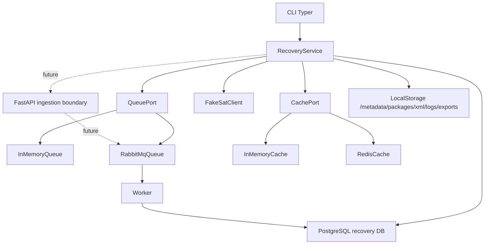
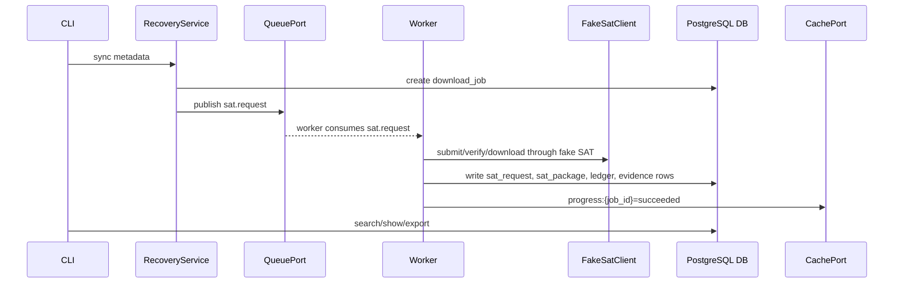
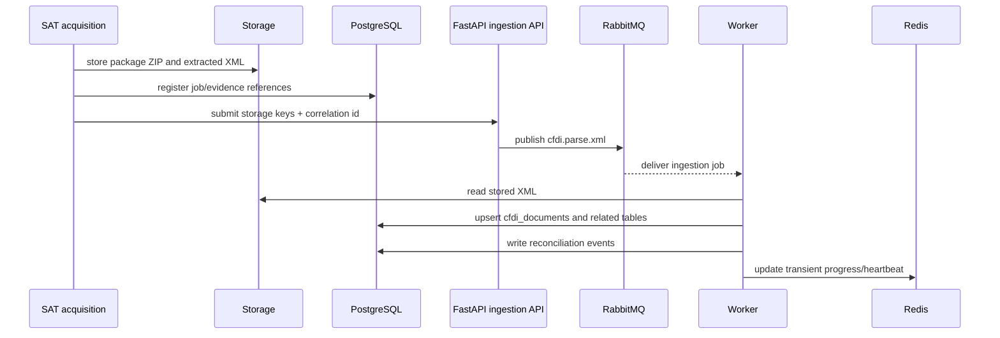

# CFDI recovery v2 implementation slice

This document explains the first implemented slice of the RabbitMQ/Redis/PostgreSQL recovery plan. PostgreSQL is the durable database for runtime, tests, and synthetic import paths.

## Quick path

```powershell
python -m pip install -e ".[dev]"
Copy-Item .env.example .env
docker compose up -d --build postgres rabbitmq redis
docker compose run --rm app doctor
docker compose run --rm app sync metadata --rfc XAXX010101000 --start 2024-01-01 --end 2024-01-31
docker compose run --rm app search fake
```

The non-Docker local CLI can still exercise fake paths, but it must use the same PostgreSQL `DATABASE_URL` boundary as Docker.

## Current boundary

| Area | Implemented now | Not yet implemented |
|---|---|---|
| SAT | deterministic fake SAT client | live SOAP, signing, token refresh |
| Queue | RabbitMQ adapter, durable event schema, enqueue mode, and worker polling for `sat.request` | post-XML ingestion queues, retry scheduler, and dead-letter policy |
| Cache | Redis adapter and progress key shape | distributed locks/rate-limit enforcement |
| Database | PostgreSQL schema with request/package/metadata/XML evidence rows and Flyway baseline migration | additional PostgreSQL full-text/trigram indexes |
| API | Not implemented yet | FastAPI ingestion boundary for stored XML/package references |
| Parser | version detector and parser registry scaffolding | deep complement normalization |
| CLI | doctor, init, sync, queue status, worker shell, search, show, print, export | rich live progress dashboard |

## Architecture



## Current queue flow



Current code can also process synchronously when `--enqueue` is not used. That is acceptable for fake demos and tests, but the target recovery architecture should push slow ingestion work through the queue boundary.

## Target post-XML ingestion flow



The acquisition path preserves evidence first. The ingestion API and workers load accounting data gradually so the CLI/SAT downloader does not become a God process with long-lived database work.

## Database strategy

The durable runtime model is PostgreSQL-first:

- relational columns for accounting fields used in filters and reports;
- JSONB payload columns for version-specific CFDI and complement data;
- XML/package evidence references with hashes;
- append-only event tables for queue and reconciliation audit.

The synthetic import command, recovery workflow, Docker runtime, and tests all use PostgreSQL. There is no alternate local database contract.

## Storage strategy

STOR-001 stores SAT evidence under `<storageRoot>/<RFC>/metadata|packages|xml/YYYY/MM/` and records SHA-256, size, storage path, and pipeline state in the database. See [Idempotent local storage](storage-design.md) for the folder layout and retry rules.

## CLI commands

```bash
cfdi-vault doctor
cfdi-vault init --tenant-id default --rfc XAXX010101000
cfdi-vault sync metadata --rfc XAXX010101000 --start 2024-01-01 --end 2024-01-31
cfdi-vault sync xml --rfc XAXX010101000 --start 2024-01-01 --end 2024-01-31
cfdi-vault sync metadata --rfc XAXX010101000 --start 2024-01-01 --end 2024-01-31 --enqueue
cfdi-vault queue status
cfdi-vault worker run
cfdi-vault reconcile
cfdi-vault search fake
cfdi-vault show <UUID>
cfdi-vault print <UUID> --format pdf --output storage/exports/invoice.pdf
cfdi-vault export --format csv --output storage/exports/cfdi.csv
```

`--enqueue` requires `RABBITMQ_URL`; without RabbitMQ, the CLI refuses it so jobs are not lost in an in-memory queue after the process exits.

Docker Compose now injects `DATABASE_URL`, `RABBITMQ_URL`, `REDIS_URL`, and `CFDI_STORAGE_ROOT` into `app` and `worker`, and exposes `flyway` for schema bootstrap from `db/migration/`.

## Next implementation steps

1. Expand Flyway migrations and add PostgreSQL full-text/trigram indexes where measured search needs justify them.
2. Define the FastAPI ingestion contract for stored XML/package references.
3. Add post-XML RabbitMQ jobs such as `cfdi.parse.xml` and `cfdi.reconcile`.
4. Expand the RabbitMQ worker into a real consumer with retry and dead-letter routing.
5. Parse package XML into full `cfdi_documents`, concepts, taxes, payments, payroll, and complement JSON through the worker path.
6. Add real SAT SOAP client behind `--live`.
7. Replace the text-only PDF with a proper HTML-to-PDF renderer.
