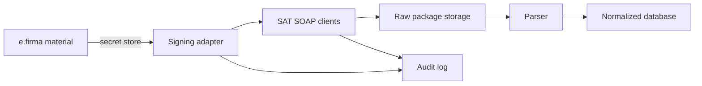

# Authentication and security model

SAT Web Service access requires e.firma material and signed SOAP requests. That makes this feature a security-boundary change, not just another HTTP client.

## Decision

Do not store e.firma files, passwords, tokens, downloaded packages, or real taxpayer XML in the public repository. The library can define interfaces and safe local examples, but real credential custody belongs to the application using the library.

## Authentication model

| Step | Requirement |
|---|---|
| Load certificate | Use the taxpayer or legal representative e.firma certificate (`.cer`). |
| Load private key | Use the matching e.firma private key (`.key`) and password. |
| Build WS-Security header | Include timestamp, binary security token, and XML signature as required by the SAT documents. |
| Request SAT token | Call authentication service and receive a short-lived token. |
| Use token | Send `Authorization: WRAP access_token="..."` in request, verification, and download calls. |
| Refresh token | Refresh before retrying if the token is expired or rejected. |

## Credential handling rules

| Rule | Why |
|---|---|
| Never commit `.cer`, `.key`, `.pfx`, `.p12`, `.pem`, or passwords. | e.firma represents taxpayer identity and must not leak. |
| Prefer external secret stores in real applications. | The library should not become a credential vault. |
| Keep token lifetime explicit. | Authentication examples show narrow validity windows; long-running jobs must refresh. |
| Log fingerprints, not secrets. | Audit needs traceability without exposing private material. |
| Separate credentials from downloaded data. | Compromise impact is lower when storage boundaries are independent. |

## Installer decisions

Do not ask a vague question like "save FIEL data?". Split setup into explicit choices.

| Installer decision | Recommended default | Why |
|---|---|---|
| Package and extracted-file storage | User-chosen local directory or object storage location. | Storage location is an operational preference and should be explicit. |
| Remember credential paths and certificate fingerprint | Yes, if the user opts in. | Lower risk than storing raw key material and useful for operator UX. |
| Store private key material and password for unattended execution | Off by default. | This turns the application into a tax-identity custodian. |
| Use detached signing | Preferred for multi-user or server deployments. | The downloader does not need broad access to the raw private key. |

## Custody modes

| Mode | Stores raw key/password? | Intended use | Required controls |
|---|---:|---|---|
| `manual-local` | No | User supplies e.firma material at runtime. | Redacted logs and no persistence of secrets. |
| `local-secure` | Encrypted only | Single-machine automation. | OS credential store, audit log, explicit consent, disable button. |
| `server-secure` | Encrypted only in a dedicated secrets boundary | Controlled backend deployments. | KMS/vault, least privilege, rotation path, access logs. |
| `detached-signer` | No in downloader | SaaS or distributed deployments. | Separate signer API, scoped signing requests, signer audit trail. |

## Third-party and legal boundary

Official SAT pages describe recovery by the emitter or receiver after authentication. The documents and examples also use the taxpayer's e.firma. This repository should not imply that a SaaS provider can freely download third-party CFDI without a valid legal and credential custody model.

Repository wording should stay precise:

- Safe: "The library can be used by an application that has lawful access to the taxpayer e.firma."
- Unsafe: "The library authorizes third-party CFDI download."

## Storage boundary for future applications

## Open-source examples policy

Examples may include:

- Synthetic certificate interface stubs.
- Fake RFC-like strings clearly marked as fake.
- Unsigned XML templates for educational structure.
- Tests that use fixtures with fake keys only if those keys cannot be mistaken for real taxpayer material.

Examples must not include:

- Real certificates.
- Real taxpayer XML.
- Passwords copied from real environments.
- Live SAT requests in default test runs.

## Review checklist

- [ ] No credential files are committed.
- [ ] `.gitignore` blocks common certificate and secret file extensions.
- [ ] Logging redacts tokens, passwords, and XML payloads containing real taxpayer data.
- [ ] The library separates signing from transport.
- [ ] Public docs distinguish technical capability from legal authorization.
- [ ] Setup makes credential custody mode explicit instead of hiding it behind convenience wording.
