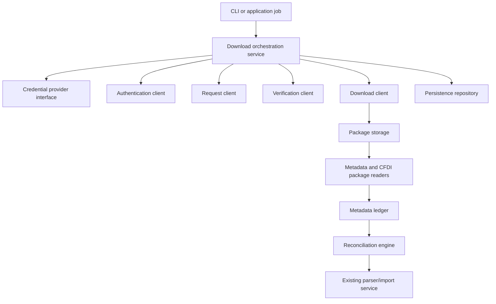

# Implementation plan for the SAT download library

Target contract:
SAT Descarga Masiva CFDI y CFDI de Retenciones v1.5, mayo 2025.

Allowed sources:
- V1_5_CONTRACT
- RUNTIME_WSDL
- COMMUNITY_ORACLE as implementation oracle only

Forbidden as operational contract:
- v1.2
- 2023 manuals
- legacy endpoints
- forums/blogs/snippets
- old prompts

This plan turns SAT Download work into reviewable implementation slices. The first production-ready library should be boring, explicit, heavily tested, and reconciliation-led.

## Target architecture

## Proposed modules

| Module | Responsibility | Notes |
|---|---|---|
| `credentials` | Load or receive e.firma material through interfaces. | No built-in secret vault in the library core. |
| `signing` | XMLDSig and WS-Security builders. | Highest-risk module; needs fixture-heavy tests. |
| `soap` | Transport, headers, SOAPAction, error capture. | Keep independent from business orchestration. |
| `requests` | v1.5 domain query objects and validation. | Must be deterministic and hashable. |
| `sat_auth` | Authentication operation. | Returns token with metadata. |
| `sat_request` | Submit v1.5 download requests. | Uses `SolicitaDescargaEmitidos`, `SolicitaDescargaRecibidos`, or `SolicitaDescargaFolio`. |
| `sat_verify` | Verify request status and package ids. | Pure parser plus transport call. |
| `sat_download` | Download package by id. | Stores raw package before extraction. |
| `packages` | Read ZIP, XML, and metadata TXT packages. | Should support streaming metadata. |
| `ledger` | Store metadata inventory and XML evidence state. | This is the control plane for retries. |
| `reconciliation` | Classify UUIDs as downloaded, pending, cancelled, quota-limited, retryable, or manual-review. | Avoids blind redownload loops. |
| `errors` | Map SAT/transport/domain failures to typed internal codes and user messages. | Keeps support and CLI/API behavior consistent. |
| `repository` | Idempotent request/package persistence. | SQLite first, but avoid hard-coding storage in domain logic. |
| `audit` | Structured events and redaction. | Never log secrets or full real XML by default. |

## Work slices

| Slice | Outcome | Acceptance checks |
|---|---|---|
| 1. Documentation and source policy | Contributors understand v1.5 contract, WSDL role, oracles, legacy references, and rejected sources. | Docs reviewed, context scanner passes, no network code. |
| 2. Domain request model | Queries can be built, validated, and hashed. | Unit tests for valid/invalid combinations. |
| 3. XML builders | SOAP and XMLDSig builders produce deterministic XML. | Golden tests with synthetic credentials. |
| 4. Transport abstraction | SOAP requests can be sent through an injectable client. | Fake transport tests; no live SAT in CI. |
| 5. Response parsers | Authentication, request, verification, and download responses parse safely. | Fixture tests for success and common errors. |
| 6. Persistence | Requests/packages are resumable and idempotent. | SQLite tests for duplicate query and package attempts. |
| 7. Metadata ledger | Metadata packages become canonical expected-document rows. | Tests for TXT metadata parsing, dedupe, and status updates. |
| 8. Reconciliation engine | UUIDs are classified before XML retries. | Tests for pending, downloaded, cancelled, expired, quota-limited, and manual-review states. |
| 9. User-facing error contract | Every failure explains what happened, what is missing, and whether retry is automatic. | Snapshot tests for CLI/API error messages. |
| 10. Orchestrator | End-to-end job state machine works against fake SAT. | Contract tests with fake async states. |
| 11. Optional live adapter | Manual integration path for maintainers with lawful credentials. | Explicit opt-in, skipped by default in CI. |

## Design decisions

| Decision | Tradeoff |
|---|---|
| Keep signing isolated from transport. | More interfaces, but easier to test and audit. |
| Use fake SAT transport in automated tests. | Less production certainty, but no secret exposure in CI. |
| Persist before parsing. | More disk/storage usage, but preserves scarce package download attempts. |
| Metadata is the control plane. | More tables and reconciliation logic, but fewer blind retries and better auditability. |
| Use v1.5 as the only operational contract. | Less ambiguity, but requires explicit conflict notes when WSDL/oracles differ. |
| Keep docs source-linked and source-classified. | More maintenance, but contributors can verify claims. |

## Minimum definition of done

- [ ] No real SAT calls in default tests.
- [ ] No real credentials or taxpayer XML in fixtures.
- [ ] Query validation is complete before signing.
- [ ] XML building is deterministic.
- [ ] All SAT responses preserve raw code/message in typed errors.
- [ ] Package bytes are stored and hashed before extraction.
- [ ] Metadata ledger can explain what exists, what is missing, and why.
- [ ] Credential custody mode is explicit during setup.
- [ ] User-facing errors redact secrets and include next action.
- [ ] Source classification follows [Source Policy](source-policy.md).
