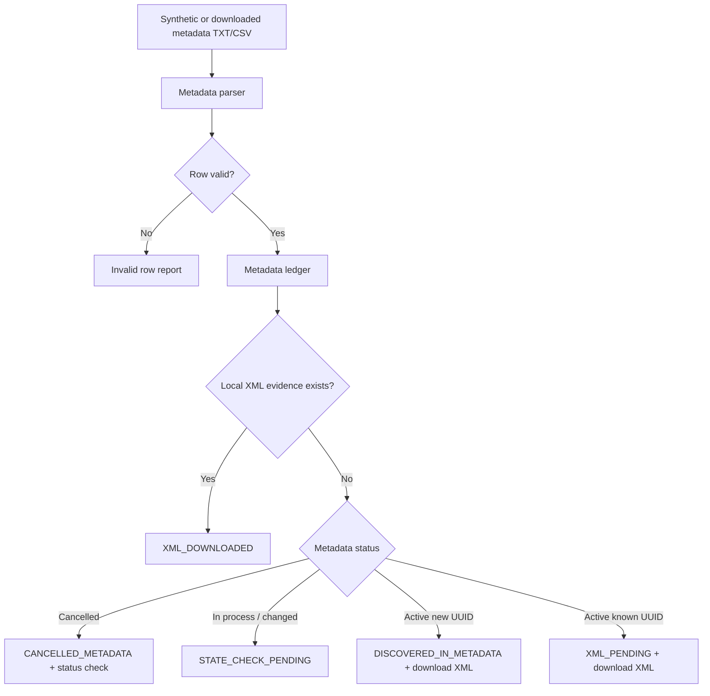

# Metadata-first reconciliation slice

Sprint 2 establishes the local reconciliation foundation before live SAT access. Metadata TXT/CSV files are parsed into a canonical ledger, compared against local XML evidence, and classified into actionable states.

## Quick path

1. Parse metadata bytes with `parse_metadata_bytes`.
2. Store the source metadata file idempotently under the configured storage root.
3. Upsert accepted rows into `cfdi_metadata_ledger`.
4. Keep rejected rows out of the ledger and return them to the caller.
5. Reconcile each UUID against local XML evidence before deciding whether to download XML, check status, retry later, or stop.

## Flow

## Parser contract

| Input | Behavior |
|---|---|
| Pipe-delimited TXT | Accepted when required columns can be mapped. |
| Comma-delimited CSV | Accepted when alias headers can be mapped. |
| Tab-delimited TXT | Reserved for the same parser path. |
| Invalid row | Returned as `InvalidMetadataRow`; not inserted into the ledger. |
| Unknown optional column | Ignored by the canonical row, preserved only in the invalid row payload when the row fails. |

Required canonical fields are UUID, issuer RFC, receiver RFC, issue date, total, status, and document effect/type.

## Reconciliation decisions

| Condition | State | Download XML? | Check status? |
|---|---|---:|---:|
| New active UUID without XML | `DISCOVERED_IN_METADATA` | Yes | No |
| Existing active UUID without XML | `XML_PENDING` | Yes | No |
| Existing UUID with XML evidence | `XML_DOWNLOADED` | No | Only if status changed or metadata says cancelled |
| Metadata says cancelled | `CANCELLED_METADATA` | No | Yes |
| Metadata is transient or changed | `STATE_CHECK_PENDING` | No | Yes |

## Retry policy

| Signal | Action |
|---|---|
| `DISCOVERED_IN_METADATA` or `XML_PENDING` | Request/download XML. |
| `STATE_CHECK_PENDING` or `CANCELLED_METADATA` | Query CFDI status before retrying XML. |
| `XML_DOWNLOADED` | Do not retry. |
| Permanent SAT/local error | Mark permanent failure. |
| Rate limit, timeout, or temporary unavailable | Retry later, not immediately. |
| Attempts exhausted | Mark permanent failure until an operator decides otherwise. |

## Status consultation boundary

Sprint 2 defines `CfdiStatusClientPort` only. It accepts `CfdiStatusQuery` and returns `CfdiStatusResult`.

This is intentionally a boundary, not a live SAT adapter. Live SAT status lookup remains a later opt-in integration after the fake path, security model, and credential custody rules are proven.

## Review checklist

- [ ] Fixtures are synthetic and scanner-safe.
- [ ] Invalid metadata rows are visible to the caller.
- [ ] Accepted metadata rows are idempotent by tenant, UUID, and direction.
- [ ] XML download is driven by reconciliation state, not blind retry.
- [ ] Cancelled and changed statuses request confirmation before XML recovery.
