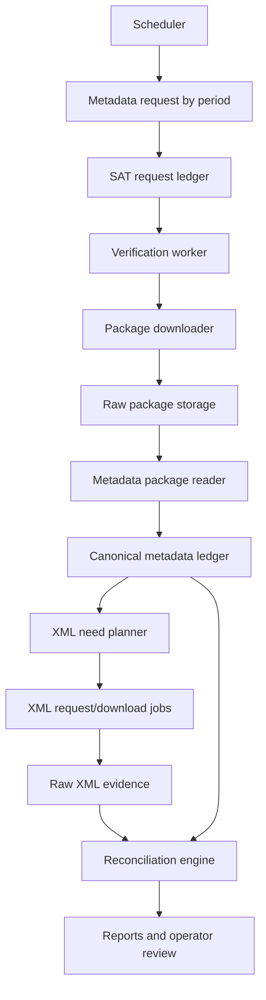

# Metadata-led reconciliation architecture

The future product should be a CFDI recovery and reconciliation service, not a simple downloader. Metadata packages define the control plane; XML packages provide the evidence plane.

## Decision

Use metadata-by-period ingestion as the authoritative ledger of expected documents. Use XML downloads to attach evidence to ledger rows when the SAT service and document status make XML recovery possible.

## Why this matters

| Problem | Downloader-only behavior | Metadata-led behavior |
|---|---|---|
| Missing XML | Retries blindly. | Checks metadata status, request/package history, and eligibility before retrying. |
| Cancelled documents | Treats cancellation as a failed download. | Models cancellation as a terminal or special reconciliation state depending on direction. |
| Duplicate SAT requests | Re-submits the same period. | Uses criteria hashes and existing request state. |
| Expired packages | Loses traceability. | Knows which ledger rows came from the expired request and can create a recovery request if needed. |
| Operator review | Requires manual TXT/CSV crossing. | Turns crossing into a repeatable reconciliation job. |

## Architecture



## Ledger records

| Record | Purpose | Key fields |
|---|---|---|
| `download_jobs` | User or scheduler intent. | tenant, RFC scope, direction, period, request type, priority. |
| `sat_requests` | SAT request lifecycle. | `id_solicitud`, criteria hash, direction, period, SAT code/message, state. |
| `sat_packages` | SAT package lifecycle. | `id_paquete`, request id, attempts, checksum, storage key, downloaded timestamp. |
| `metadata_ledger` | Expected document inventory. | UUID, direction, RFCs, issue date, status, first seen, last seen, source package. |
| `xml_evidence` | Downloaded XML proof. | UUID, package id, XML SHA-256, storage key, parser version. |
| `reconciliation_events` | Why the system made a decision. | UUID, previous state, new state, reason, actor, timestamp. |
| `signer_audit` | Credential use traceability. | certificate fingerprint, operation, request id, timestamp, signer mode. |

## Reconciliation states

| State | Meaning | Next action |
|---|---|---|
| `metadata_seen` | UUID exists in metadata, XML need not decided yet. | Classify by status, direction, and local evidence. |
| `pending_xml` | XML is expected and not stored yet. | Create or attach to XML request job. |
| `downloaded_xml` | XML evidence is stored and hash-tracked. | No retry. |
| `cancelled_no_xml_expected` | Metadata says cancelled and the current path should not expect XML. | No retry unless operator overrides. |
| `expired_package_retryable` | Package expired before XML was stored. | Create a recovery request with a new criteria hash variant. |
| `quota_limited` | SAT quota or folio limit blocks progress. | Defer to the next allowed cycle. |
| `manual_review` | Metadata, request status, and evidence conflict. | Operator review. |

## Windowing policy

Partition time deterministically so the same period is not submitted accidentally.

| Workload | Default window | Why |
|---|---|---|
| Historical backfill | Monthly | Keeps requests understandable and resumable. |
| Normal daily sync | Daily | Minimizes duplicate and expired package risk. |
| High-volume RFC | Hourly or smaller | Reduces result-size and timeout risk. |
| Recovery variant | Slight adjusted boundary with explicit reason | Avoids pretending it is the original query while preserving audit. |

## Criteria hash

Build a stable hash from normalized request criteria:

```text
sha256(
  tenant + document_family + direction + request_type + period_start + period_end +
  requester_rfc + issuer_rfc + sorted(receiver_rfcs) + status + document_type +
  complement + rfc_on_behalf + recovery_variant_reason
)
```

If an active or completed request already has the same hash, the system should not submit another SAT request automatically.

## Invoice-level status check

Invoice-level status lookup is useful, but it is not the main retry controller.

| Use it when | Do not use it when |
|---|---|
| Metadata says a UUID exists but XML evidence is missing and classification is ambiguous. | The SAT request is still accepted or in process. |
| A user disputes whether a document should be retried. | Metadata already explains that cancelled XML is not expected for the current path. |
| Reconciliation finds contradictory local evidence. | A package simply has not been downloaded yet. |

The primary retry controller remains SAT request/package status. Invoice-level status is an auxiliary validator for UUID-level disputes.

## Review checklist

- [ ] Metadata ingestion exists before broad XML retry automation.
- [ ] Every SAT request has a criteria hash.
- [ ] Every package is stored and hashed before extraction.
- [ ] Reconciliation states explain why a UUID is pending, terminal, or manual-review.
- [ ] Installer/setup separates storage location from credential custody.
