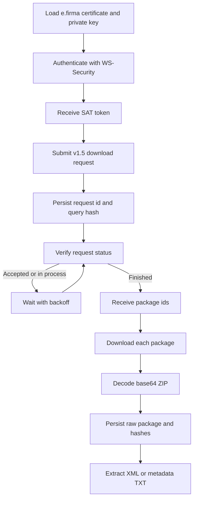

# SAT Web Service flow

Target contract:
SAT Descarga Masiva CFDI y CFDI de Retenciones v1.5, mayo 2025.

Allowed sources:
- V1_5_CONTRACT
- RUNTIME_WSDL
- COMMUNITY_ORACLE as implementation oracle only

Forbidden as operational contract:
- v1.2
- 2023 manuals
- legacy endpoints
- forums/blogs/snippets
- old prompts

The SAT download service is not a REST JSON API. It is an asynchronous SOAP/WCF workflow: authenticate, request, verify, and download.

## Quick path



## Productive CFDI endpoints

Runtime WSDL must be checked before endpoint/operation changes.

| Service | Endpoint | Operation family |
|---|---|---|
| Authentication | `https://cfdidescargamasivasolicitud.clouda.sat.gob.mx/Autenticacion/Autenticacion.svc` | `Autentica` |
| Request | `https://cfdidescargamasivasolicitud.clouda.sat.gob.mx/SolicitaDescargaService.svc` | `SolicitaDescargaEmitidos`, `SolicitaDescargaRecibidos`, `SolicitaDescargaFolio` |
| Verification | `https://cfdidescargamasivasolicitud.clouda.sat.gob.mx/VerificaSolicitudDescargaService.svc` | `VerificaSolicitudDescarga` |
| Download | `https://cfdidescargamasiva.clouda.sat.gob.mx/DescargaMasivaService.svc` | `Descargar` |

## Productive retenciones endpoints

| Service | Endpoint |
|---|---|
| Authentication | `https://retendescargamasivasolicitud.clouda.sat.gob.mx/Autenticacion/Autenticacion.svc` |
| Request | `https://retendescargamasivasolicitud.clouda.sat.gob.mx/SolicitaDescargaService.svc` |
| Verification | `https://retendescargamasivasolicitud.clouda.sat.gob.mx/VerificaSolicitudDescargaService.svc` |
| Download | `https://retendescargamasiva.clouda.sat.gob.mx/DescargaMasivaService.svc` |

## SOAP transport expectations

| Area | Expected behavior |
|---|---|
| Protocol | SOAP over HTTP POST. |
| Content type | `text/xml` or `text/xml; charset=utf-8`, confirmed per WSDL/operation. |
| Authorization after authentication | Header format: `Authorization: WRAP access_token="..."`. |
| Request signing | XMLDSig over the v1.5 request payload, using the e.firma certificate/private key. |
| Download response | SOAP XML containing a base64-encoded ZIP package. |
| Metadata package | TXT rows inside ZIP; CSV is local export. |

## Package lifecycle

| Event | Repository behavior |
|---|---|
| Request accepted | Persist `id_solicitud`, query criteria, and query hash before polling. |
| Request processing | Poll with backoff; do not spin in a tight loop. |
| Request finished | Persist every `id_paquete` before downloading. |
| Package downloaded | Persist raw ZIP bytes or object-storage reference, SHA-256, and attempt count. |
| Package expired | Mark terminal state; do not retry forever. |
| Package downloaded twice | Treat as exhausted; require a new valid request. |

## Implementation boundary

The client should expose small operations, not one magic method:

```text
Authenticator.authenticate(credentials) -> Token
RequestClient.submit(query, token) -> RequestReceipt
VerificationClient.verify(request_id, token) -> VerificationResult
DownloadClient.download(package_id, token) -> DownloadedPackage
```

The application layer can compose those operations into a job pipeline.
